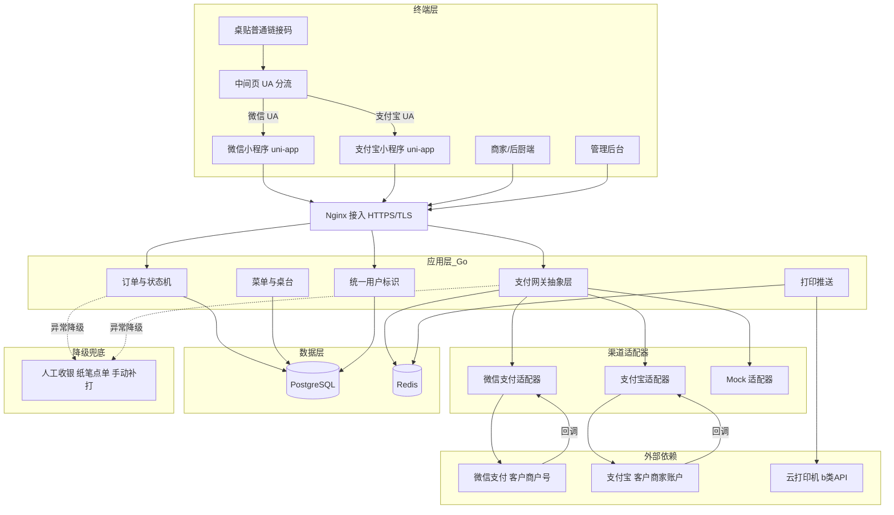
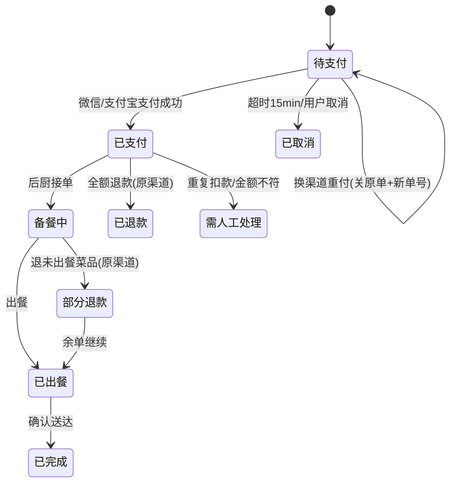
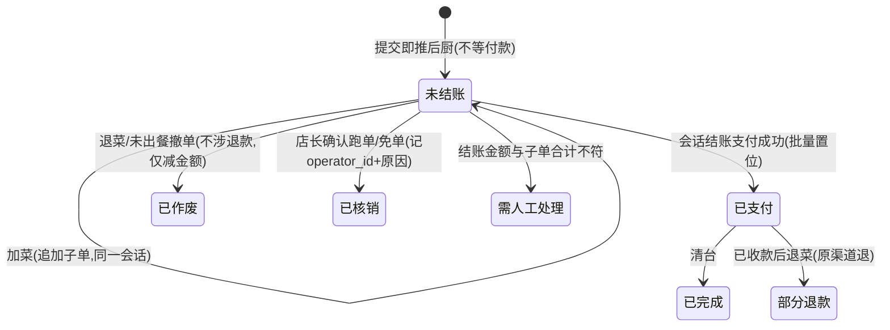
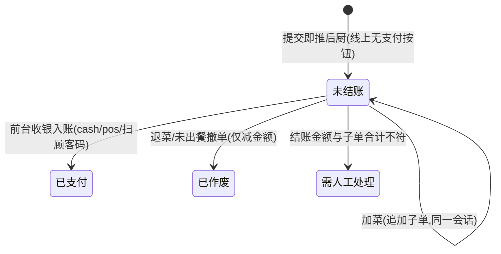
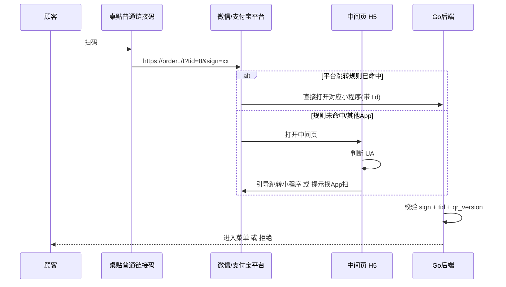
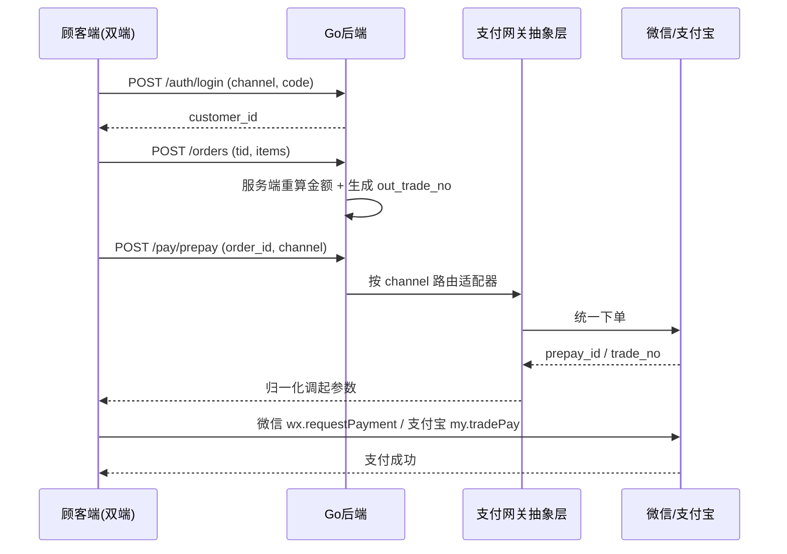
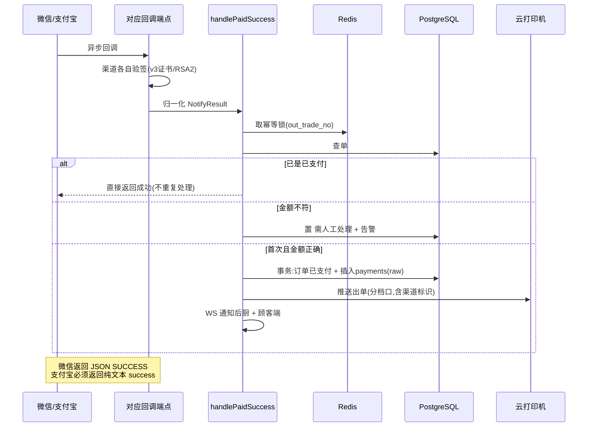
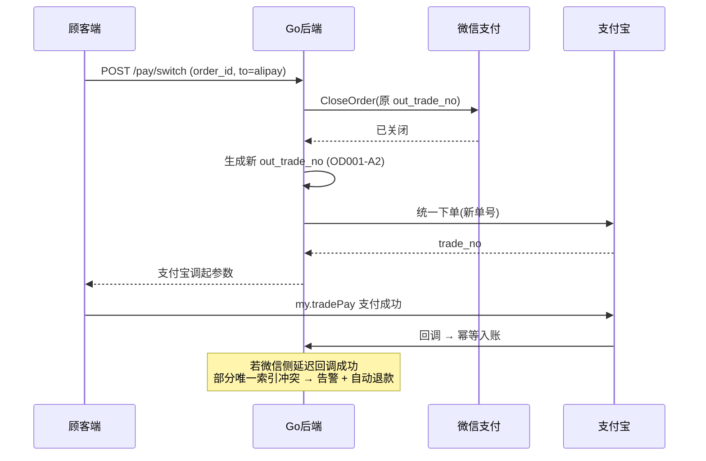
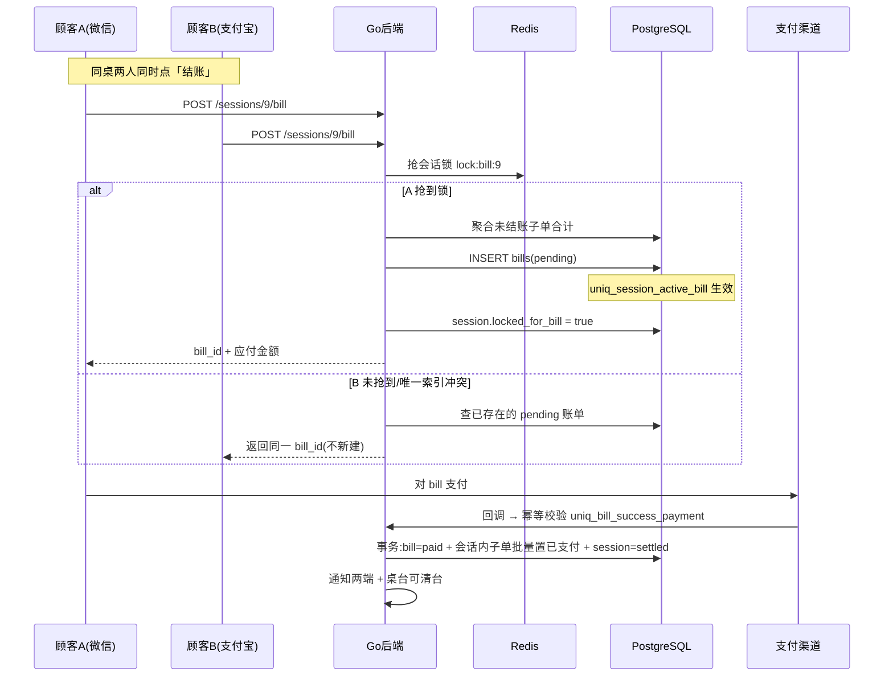
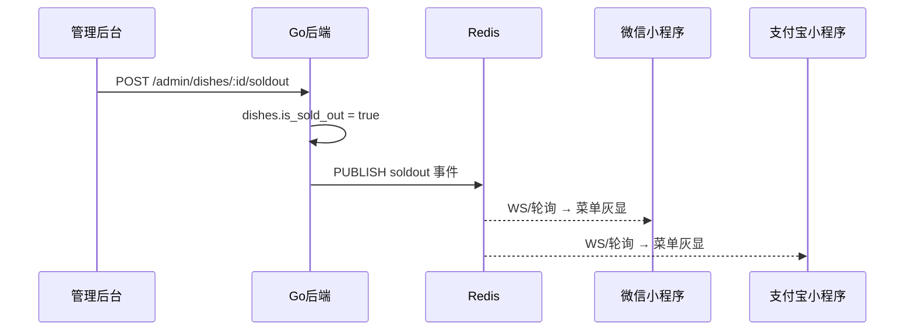

# 悦点（Yodian）· 扫码点餐系统设计方案

> 版本：v1.8 ｜ 适用：单店扫码点餐（堂食为主，自提/外带 Phase 2）
> 后台：Go ｜ 前台：uni-app（Wot Design Uni）一套代码编译**微信 + 支付宝双小程序**
> 商家端/管理后台：Vue3 + Vite + Ant Design Vue 4（同一 Web 工程，路由分区）
> 支付：微信支付 v3 + 支付宝，网关抽象层适配，全部配置化 + 可模拟
> 结账：**先付 / 后付 / 仅点单前台结 三模式，按桌台配置**（3.7）
> 按人收费项：餐位费/餐具/餐巾纸等按就餐人数计费，会话级一次性计入（3.8）
> 数据安全：每日全量 + WAL 归档 PITR，备份异地留存 30 天（第 12 章）
> 部署：上云单 CVM（低配 2C2G 可行，见 15.8）+ 云 PG + Redis + 对象存储 + CDN，月成本约 ¥300–500（第 15 章）
> 接口契约/鉴权/限流：统一响应包络 + 错误码体系 + JWT 权限矩阵 + 限流熔断（第 16 章）

---

## 1. 项目背景与关键约束

| 项 | 结论 |
|---|---|
| 规模 | 单店，月营业额约 30w（日均 ~150 单），并发压力低，架构从简 |
| 角色 | 乙方开发，客户持有支付资质主体 |
| 后台 | Go（1.22+，Gin/Echo + GORM/sqlx + PostgreSQL + Redis） |
| 前台 | **uni-app 一套代码编译双端**：微信小程序 + 支付宝小程序，UI 库 **Wot Design Uni** |
| 商家端 | Vue3 + Vite + TS + Pinia + **Ant Design Vue 4**，Web 载体（不做小程序，避免第三、四套审核）；后厨 KDS 用 antdv `darkAlgorithm` 暗色主题 |
| 支付 | **双渠道**：微信支付 v3（小程序支付，JSAPI 下单）+ 支付宝小程序支付；经统一网关抽象层接入 |
| 桌贴 | **普通链接二维码**（非小程序码），微信/支付宝各自「扫普通码跳小程序」规则 + 中间页兜底 |
| 结账模式 | **先付后吃 / 后付统一结账 / 仅点单前台结 三模式并存，按桌台粒度配置**（`tables.pay_mode`）：包间/正餐台走后付，散台/外带走先付，二维火过渡期用仅点单前台结（3.7） |
| 按人收费项 | 餐位费/餐具/餐巾纸/湿巾等按就餐人数计费，默认勾选/必选可配；**会话级一次性计入**，避免先付加菜重复收费（3.8） |
| 范围 | MVP：扫码 → 选就餐方式/人数 → 点餐 → 双渠道支付/结账 → 出单闭环，含**可选手机号授权**与**按人收费项**。**优惠券折扣、会员储值、电子发票、服务员代客点单四项确认为二期**，自提/外带取餐码 Phase 2，MVP 不实现但表结构与金额链路提前预留，二期不改核心（7.5） |
| 现状 | 客户在用二维火（服务员点餐）；后厨为通用 80mm 热敏打印机，走 b 类厂商云 API 复用，不新增硬件 |
| 打印 | 优先 b 类厂商云打印 API（飞鹅/芯烨/商米等），单店省运维、上线快 |
| 微信资质 | 客户名下（营业执照 + 食品经营许可证 + 微信支付商户号），乙方作为开发者接入 |
| 支付宝资质 | **待确认**，按全配置化 + `MOCK_ALIPAY` 开关开发，不阻塞进度；上线前补齐 |
| 可模拟性 | 微信、支付宝、打印三方全部配置化 + 独立模拟开关，开发期 mock 跑通，上线仅替换配置值 |
| 数据安全 | **RPO ≤ 5min / RTO ≤ 30min**；每日全量 + WAL 归档 PITR + 云主机快照，备份异地对象存储保留 **30 天**；业务订单数据本身永久保留（第 12 章） |

**双渠道带来的四处结构性改动**（本版重点）

1. **前台载体**：从「微信原生小程序」改为「uni-app 双端编译」，支付/登录/消息三处需条件编译（第 9 章）。
2. **二维码方案**：小程序码互不通用，改用普通链接码 + 双平台跳转规则（第 4 章，独立成章）。
3. **用户标识**：微信 `openid` 与支付宝 `user_id` 异构，抽 `customers` 统一标识；拼桌需支持跨渠道混合（3.4 / 7.1）。
4. **对账口径**：从三流（微信/现金/POS）变**四流**（微信/支付宝/现金/POS）（第 5 章）；v1.4 统一为**六口径**（+挂账/外卖核券，第 5 章）。

---

## 2. 系统架构



**分层说明**

- **终端层**：桌贴普通链接码 → 中间页按 UA 分流 → 微信/支付宝小程序（同一 uni-app 代码库）；另有商家后厨端、管理后台。
- **应用层（Go 模块化）**：订单与状态机、**支付网关抽象层**、统一用户标识、菜单与桌台、打印推送。
- **渠道适配器**：微信支付 / 支付宝 / Mock 三个实现，同一接口，运行时按 `pay_channel` 路由。
- **数据层**：PostgreSQL 存订单/菜品/桌台/顾客/会话；Redis 扛幂等锁、桌台会话与沽清广播。
- **外部依赖**：微信支付（客户商户号）、支付宝（客户商家账户）、云打印机（b 类厂商 API）。
- **降级兜底**：任何层异常均可降级到人工收银（第 5 章）。

**架构要点**：新增的支付网关抽象层是本版核心。上层订单逻辑**完全不感知渠道**，只传 `pay_channel`；新增渠道（如银联/数字人民币）只需加一个适配器，不动订单代码。

---

## 3. 核心模块设计

### 3.1 订单状态机

三条主干，按桌台 `pay_mode` 分流（3.7）：

- **先付**：`待支付 → 已支付 → 备餐中 → 已出餐 → 已完成`
- **后付**：`未结账 →（结账支付成功）→ 已支付 → …`，其中 `未结账` 态**已推后厨、已出餐**，只是钱未收
- **仅点单前台结**：`未结账 →（前台收银 cash/pos/扫顾客码入账）→ 已支付 → …`，**线上不可支付**，钱在前台收

外加 `已取消 / 已退款 / 部分退款 / 需人工处理`。状态迁移只在服务端校验，前端只发「事件」。**状态机与支付渠道无关**——渠道差异被网关层吸收；但**与结账模式有关**，`pay_mode` 决定走哪条主干。

### 3.2 支付网关抽象层（本版核心）

Go 侧定义统一接口，微信/支付宝/Mock 各自实现，业务层按 `pay_channel` 路由：

```go
type PayChannel string

const (
    ChannelWechat PayChannel = "wechat"
    ChannelAlipay PayChannel = "alipay"
)

// 统一支付网关接口：上层订单逻辑不感知具体渠道
type PaymentGateway interface {
    Channel() PayChannel
    // 预下单，返回前端调起支付所需参数（结构因渠道而异，用 map 承载）
    Prepay(ctx context.Context, req PrepayReq) (PrepayResp, error)
    // 验签并解析异步回调，失败返回 error（禁止吞掉验签错误）
    VerifyNotify(ctx context.Context, raw NotifyRaw) (NotifyResult, error)
    // 主动查单，用于弱网补单与对账
    QueryOrder(ctx context.Context, outTradeNo string) (TradeStatus, error)
    // 关闭未支付订单，换渠道重付前必须调用
    CloseOrder(ctx context.Context, outTradeNo string) error
    // 退款，支持部分退款
    Refund(ctx context.Context, req RefundReq) (RefundResp, error)
}

type PrepayReq struct {
    OutTradeNo  string
    TotalAmount int64  // 单位：分，统一整数避免浮点误差
    Subject     string
    ChannelUID  string // 微信 openid / 支付宝 user_id
    NotifyURL   string
}

// 各渠道回调归一化后的统一结果
type NotifyResult struct {
    OutTradeNo    string
    ChannelTradeNo string // 微信 transaction_id / 支付宝 trade_no
    PaidAmount    int64
    Success       bool
    RawPayload    []byte // 原文入库存档，便于对账与纠纷举证
}

// 运行时路由
type GatewayRegistry map[PayChannel]PaymentGateway

func (r GatewayRegistry) Get(c PayChannel) (PaymentGateway, error) {
    gw, ok := r[c]
    if !ok {
        return nil, fmt.Errorf("unsupported pay channel: %s", c)
    }
    return gw, nil
}
```

**设计约束**
- 金额统一用 **int64 分**，禁止 float。入库 `NUMERIC(10,2)` 时再换算。
- `RawPayload` 必须原文存档（`payments.callback_raw`），对账与纠纷时是唯一凭据。
- `MOCK_PAYMENT=true` 时注册 Mock 适配器，其 `VerifyNotify` 直通、`Prepay` 返回假参数，但**触发的内部处理函数与真实渠道完全相同**，保证逻辑一致性。

**渠道差异对照**

| 项 | 微信支付 v3 | 支付宝 |
|---|---|---|
| 预下单 | JSAPI 统一下单 → `prepay_id` | `alipay.trade.create` → `trade_no` |
| 前端调起 | `wx.requestPayment`（需签名串） | `my.tradePay`（传 `tradeNO`） |
| 用户标识 | `openid`（`wx.login` code 换取） | `user_id`（`my.getAuthCode` 换取） |
| 验签 | 平台证书 / 公钥，SHA256-RSA | 支付宝公钥 RSA2 |
| 回调确认 | 返回 `{"code":"SUCCESS"}` | **必须返回纯文本 `success`** |
| 单号长度 | 6–32 位 | 最长 64 位 |
| 退款 | `refunds/domestic/refunds` | `alipay.trade.refund` |
| 关单 | `close` 接口 | `alipay.trade.close` |

**易错点**：支付宝回调必须返回纯文本 `success`（非 JSON），否则支付宝会持续重试 25 小时。这是双渠道最常见的接入 bug。

### 3.3 支付幂等与双渠道回调

两个渠道各有独立回调端点，但**汇聚到同一内部处理函数**：

```go
// 两个 HTTP handler 分别验签，之后调用同一核心逻辑
func (s *PayService) handlePaidSuccess(ctx context.Context, r NotifyResult) error {
    // 1. Redis 分布式锁，key = "pay:lock:" + OutTradeNo
    // 2. 查库：订单已是已支付 → 直接返回成功（幂等出口）
    // 3. 校验金额：r.PaidAmount 必须等于服务端重算金额，不等则告警挂起人工处理
    // 4. 事务内：更新 orders 状态 + 插入 payments（含 raw）
    // 5. 事务外：推云打印 + WS 通知后厨 + 通知顾客端
}
```

**幂等三重保障**
1. `orders.out_trade_no` 全局唯一索引。
2. `payments` **部分唯一索引**：一个订单最多一条成功支付记录（下方 SQL）。
3. Redis 锁去重，防并发回调。

**金额校验**：回调金额必须等于服务端重算金额，不等则**不置已支付**、告警转人工，防篡改少付（风险 6.1）。

### 3.4 统一用户标识与桌台会话（双渠道新增）

微信 `openid` 与支付宝 `user_id` 是异构标识，且**同一桌可能两种渠道用户混合**。抽两层模型：

- **`customers`**：`(channel, channel_uid)` 唯一，屏蔽渠道差异，订单只关联 `customer_id`。
- **`table_sessions`**：一次「开台到清台」的会话。同一 `table_id` 的所有顾客（无论渠道）进入同一 `session_id`，拼桌共享、合并结账、清台归档都以会话为单位。

**为什么必须有会话表**：v0.5 用 `table_id` 直接聚合拼桌，跨渠道后无法区分「上一桌客人的遗留订单」和「本桌新客人」，清台边界会糊掉。会话表把边界显式化。

### 3.5 菜单与桌台

菜品含分类/规格/加料/`is_sold_out`；桌台 `table_id` 绑定二维码；菜单变更经 Redis 发布订阅实时同步双端；二维码带签名/时效防掉包（第 4 章）。

**桌台状态的唯一事实来源是 `table_sessions` 的 active 会话**，`tables.status`（empty/occupied）仅为桌台图与查询展示的**冗余派生字段**：开台/清台/并桌/核销时由服务端在同一事务内同步更新，任何时刻以前者为准，禁止两处独立写入——否则会出现「会话已清台但桌台仍占用」的脏状态。

### 3.6 打印推送

走 b 类厂商云打印 API，按档口分单，失败重试 + 告警。小票需打印**支付渠道**（微信/支付宝/现金），便于后厨与收银核对。

### 3.7 结账模式：先付 / 后付 / 仅点单前台结 三模式（v1.2 双模式，v1.4 扩三态）

客户现用二维火是服务员点餐 + 后付结账。若上线后强制全店先付，正餐场景每加一次菜就要付一次款，体验割裂、老板大概率不接受。因此**三种模式并存，按桌台粒度配置**。

**配置位置**：`tables.pay_mode`，取值 `prepay`（先付后吃）/ `postpay`（后付统一结账）/ `frontend`（仅点单前台结）。管理后台可按桌台单独设置，也可批量设置。

| 维度 | `prepay` 先付后吃 | `postpay` 后付统一结账 | `frontend` 仅点单前台结 |
|---|---|---|---|
| 适用 | 散台、快餐位、外带自取 | 包间、正餐大台 | 需服务员核单、押金、老年顾客、二维火过渡期 |
| 出单时机 | **支付成功后**才推后厨 | **提交即推后厨**，不等付款 | 提交即推后厨，**线上不可支付** |
| 加菜 | 每次加菜都是一笔独立支付 | 只追加菜品，结账时一次付清 | 只追加菜品，到前台一并结 |
| 结账方式 | 线上支付 | 会话结账（线上/代客） | **前台收银**（现金/POS/扫顾客付款码），顾客端无支付按钮 |
| 跑单风险 | 无 | **有**，需防控（见下） | 前台核单兜底 |
| 订单主键 | 一笔订单 = 一笔支付 | 一个会话 N 笔子单 = 1 笔结账支付 | 一个会话 N 笔子单 = 1 笔前台结账 |

#### 后付模式的核心：结账以「会话」为单位，不是订单

后付制下，一桌吃完要付的是**整桌合计**，不是某一笔子单。所以：

- 顾客每次提交 → 生成一笔 `status = 未结账` 的订单，挂同一 `session_id`，**立即出单**。
- 结账时 → 服务端聚合该 `session_id` 下所有 `未结账` 订单，**生成一笔结账单**（`bills` 表），只对这一笔调用支付网关。
- 支付成功 → 会话内所有子单批量置 `已支付`，会话置 `settled`，桌台可清台。

关键约束：**结账单金额由服务端聚合计算**，顾客端只展示。金额校验、优惠计算（二期）都在这一步做，前端传的数字永不作为扣款依据。

#### 后付模式必须做的四项防控

1. **跑单防控（最重要）**：桌台在 `占用中` 且存在 `未结账` 订单时，KDS/收银端桌台图**标红提示**；清台操作强制校验——有未结账金额时不允许直接清台，必须走「已结账」或「店长确认核销」（记 `operator_id` + 原因，进日志）。
2. **结账并发**：一桌两人同时点结账会生成两张结账单，重复扣款。用 `session_id` 加 Redis 锁 + `bills` 对 `session_id` 建**部分唯一索引**（一个会话最多一张待支付/已支付账单），数据库层硬阻断。
3. **结账中锁单**：结账单生成后到支付完成前，该会话**禁止加菜**（否则金额对不上）。前端置灰加菜入口，服务端同步校验；超时未付则关闭结账单、解锁会话，允许重新发起。
4. **不能用超时关单**：先付模式 15min 自动关单（风险 6.5）**绝不能套用到后付**——后付订单本来就长期未支付，误关会导致后厨已出餐的单消失。定时任务必须按 `pay_mode` 分流，`postpay` 单只在会话结束时才终结。

#### 混合场景的两个边界

- **换桌/并桌**：两个会话合并时，`未结账` 子单一并迁移到目标会话，金额重新聚合。
- **同一桌多模式混用**：不允许。`pay_mode` 是桌台属性，会话开台时快照到 `table_sessions.pay_mode`，中途改桌台配置不影响进行中的会话——避免吃到一半规则变了。

---

### 3.8 按人收费项与就餐人数（v1.4 新增）

餐位费、餐具费、餐巾纸、湿巾等**按就餐人数计费**的附加项。顾客扫码后**先选就餐人数**，结算/结账时系统按 `单价 × 人数` 自动核算。

**配置**：管理后台「系统设置 → 按人收费项」维护（`per_head_charges` 表，7.1）：名称、单价、默认勾选、是否必选、是否启用、排序。必选项（如餐位费）顾客不可取消。人数上限 1–20，防误填。

**金额链路（关键设计）**：按人收费项**必须按会话一次性计入，不能挂到每笔 `orders`**——否则先付台加菜会重复收费（首单收一次、加菜又收一次）。

- 后付 / 仅点单前台结：按人项只在**结账账单 `bills`** 里计入一次（`order_items.item_type='per_head'` 挂结账单，账单聚合时服务端一并补算）。
- 先付：只在**会话第一笔订单**计入一次，服务端按 `session_id` 去重，后续加菜单不再计。
- 按人项数量随人数可配置按 `pax`（`table_sessions.pax`）重算；人数变更后服务端刷新未结账单的按人项金额。

**顾客端**：扫码 → 选就餐人数（可随时改）→ 结算页展示按人收费项（默认勾选/必选按商家配置，可切换）→ 小计随人数变化 → 合计 = 菜品 + 按人项。

**小票 / 对账**：按人项作为**独立账单行**打印，便于后厨与收银核对；报表**单列「按人收费项营收」**，不与菜品营收混淆（11.4）。

### 3.9 就餐方式与取餐码（v1.4 新增，取餐码 Phase 2）

顾客扫码后选择就餐方式：**堂食（桌台码）/ 自提 / 外带**。

- 堂食：绑定 `table_sessions`，走本方案主流程（本版全部 MVP 验收围绕堂食）。
- 自提 / 外带（Phase 2）：用**门店码**（不带桌号）下单，生成**取餐号**，出餐叫号；`orders` 增加 `order_type`（`dine_in`/`pickup`/`takeaway`）与 `pickup_no`，MVP 预留字段即可（7.1）。

---

## 4. 一码双扫方案（双渠道核心技术点）

### 4.1 为什么不能用小程序码

微信小程序码只能微信识别，支付宝小程序码只能支付宝识别，**两者互不通用**。桌上贴两个码让顾客自己挑，会显著提升误扫率和服务员解释成本，不可接受。

**结论**：桌贴必须使用**普通链接二维码**（内容是一个 https URL），由平台各自的「扫普通链接二维码跳小程序」能力接住。

### 4.2 桌贴 URL 与双平台跳转规则

桌贴内容示例：

```
https://order.example.com/t?tid=8&ts=1756900000&sign=a1b2c3d4
```

| 扫码环境 | 处理路径 |
|---|---|
| 微信 | 微信公众平台配置「扫普通链接二维码打开小程序」规则（需域名校验）→ 直接打开微信小程序，不经浏览器 |
| 支付宝 | 支付宝开放平台配置「二维码链接跳转小程序」→ 直接打开支付宝小程序 |
| 其他 App（相机/QQ/浏览器） | 落到中间页 H5，提示「请用微信或支付宝扫码」+ 引导按钮 |

**两个平台都需要提前配置规则并完成域名归属校验**，这是**上线硬前置**，且审核需要时间，必须早于开发完成时点启动（见第 13 章检查单）。

### 4.3 中间页兜底设计

即使配置了跳转规则，仍需保留中间页 `H5` 作为兜底，处理三类情况：

1. 规则未生效 / 平台灰度异常 → 中间页按 UA 判断，微信内引导「点击进入小程序」，支付宝内同理。
2. 非微信非支付宝环境 → 明确提示与二维码合法性说明，**不暴露任何点单能力**。
3. 桌贴签名失效 → 直接展示「二维码无效，请联系服务员」，不进入菜单。

中间页必须**极轻**（单文件、无框架、内联样式），目标 200ms 内可见，否则扫码到可点的 2 秒目标会被击穿。

### 4.4 签名与防掉包

桌贴 URL 参数必须签名，防止他人伪造 `tid` 或替换桌贴指向钓鱼页：

- `sign = HMAC-SHA256(secret, tid + ts)` 截断，`secret` 仅存服务端。
- 服务端校验：`sign` 正确 + `tid` 存在 + `ts` 在有效期内 + `qr_version` 未吊销。`ts` 为签发时间戳，**有效期取长期（默认 365 天，配置 `QR_TTL_DAYS`）**——`sign` 的作用是防伪造与防重放旧码，不做短时效；物理防掉包靠覆膜、编号、巡检承担，应急吊销靠 `qr_version` 递增。两条机制不冲突，避免频繁换贴。
- 校验失败一律拒绝进入菜单（前台异常屏）。
- 物理层面：桌贴覆膜、编号、定期巡检（运营手册）。

### 4.5 渠道选择时机

顾客扫码后**渠道即已确定**（在微信里扫就是微信，在支付宝里扫就是支付宝），无需让顾客手动选择支付方式，体验反而比多渠道选择更简洁。

**但必须支持换渠道重付**：微信支付失败的顾客可能想改用支付宝。此时不能简单换个网关重下单，见风险 6.10 与 7.4 时序图 4。

---

## 5. 降级与对账方案（六口径）

**核心目标**：人工单「可见、可补、可对账」，打烊**六口径**能对上（微信/支付宝/现金/POS/挂账/外卖核券）。

### 5.1 降级触发

支付（任一或全部渠道）/ 打印连续异常 → 商家端一键「降级模式」，新单默认走线下流程并提示店员。

### 5.2 订单模型兼容线下单

- `source`：`online` / `offline`
- `pay_channel`：`wechat` / `alipay` / `cash` / `pos`
- `operator_id`：收银员，用于追责与交接班

人工单创建即为 `已支付/已完成`，**不进支付回调流程**（钱未走线上接口）。

### 5.3 多来源对账闭环（六口径）

| 资金流 | 来源 | 系统侧对照 |
|---|---|---|
| 微信商户流水 | 微信商户平台 | `payments` 中 `channel=wechat & status=success` |
| 支付宝商家流水 | 支付宝商家中心 | `payments` 中 `channel=alipay & status=success` |
| 现金 | 收银抽屉盘点 | `orders` 中 `pay_channel=cash` |
| POS | POS 机对账单 | `orders` 中 `pay_channel=pos` |
| 外卖核券（Phase 2） | 美团/饿了么/抖音到店券核销 | 平台核销记录 vs `orders.pay_channel=platform`（预留枚举） |

**双渠道对账新增痛点**：微信和支付宝的钱进的是**两个不同账户**，客户需分别提现、分别核对。管理后台报表必须按 `pay_channel` 拆分展示，并提供**六口径差异提示**（第 11 章）。这一点务必在交付时向客户当面讲清，否则打烊对账会直接找你。

**后付制带来的第五个口径：挂账（不是资金流）**

后付订单在结账前处于 `未结账`，**钱还没进任何账户**。对账时必须单独一栏：

| 口径 | 含义 | 归属 |
|---|---|---|
| 未结账挂账额 | 已出餐但未收款 | **不计入当日已收营业额**，只作提醒 |
| 核销额 | 跑单/免单/招待 | 计入损耗，按操作人统计（11.4） |

**第六个口径：外卖核券（Phase 2）**：美团/饿了么/抖音到店券核销，钱由**平台结算（抽佣后）**，系统侧对照平台核销记录（`orders.pay_channel=platform` 预留枚举，7.5）。平台券核销是"券来源 + 平台结算"，与自营直连完全两套账，归并对账差异进「需人工处理」。

**关键规则**：打烊时「六口径合计」应等于「当日已支付订单额」；未结账与核销**单独列示**，不混入任何资金流。若把挂账算进营业额，账面永远比实收多，客户会以为系统丢钱。

**跨营业时段的挂账**：一桌若从午市挂到晚市才结账，营业额按**结账时间**归属，不按下单时间——与渠道流水的入账时间保持一致，否则日报对不上。

### 5.4 退款分流

- `wechat` 单走微信退款 API（部分/原路）
- `alipay` 单走支付宝退款 API（部分/原路）
- `cash` / `pos` 单走线下，系统仅记一笔退款流水
- **严禁跨渠道退款**（如微信收的钱走支付宝退），资金无法对上且违规
- **后付未结账单不走退款**：钱还没收，退菜直接作废子单项、减少应付额即可，不调任何渠道退款 API（7.2）

---

## 6. 风险清单（已纳入设计）

| # | 风险 | 应对 | 双渠道新增 |
|---|---|---|---|
| 6.1 | 金额前端篡改少付 | 服务端重算 + 回调金额校验（3.2/3.3） | |
| 6.2 | 二维码被掉包/钓鱼 | HMAC 签名 + tid 校验 + 物理巡检（4.4） | |
| 6.3 | 沽清后仍在售 | Redis 发布订阅实时同步双端（3.5/9.6） | 需同步两端小程序 |
| 6.4 | 拼桌多点/加菜/退菜 | 桌台会话 + 状态机分支（3.4/7.2） | 跨渠道混合拼桌 |
| 6.5 | 未支付占座死单 | 定时任务超时关单，**同时调用渠道关单接口**（7.2） | 需关两侧渠道单 |
| 6.6 | 伪造回调 | 微信证书验签 + 支付宝 RSA2 验签，验签失败即拒 | 两套验签逻辑 |
| 6.7 | 打印机离线/宕机无感知 | 推送重试 + 告警 + PG 备份（3.6） | |
| 6.8 | 合规/硬件/培训 | 双平台隐私告知、公示执照、UPS、操作手册（9.9） | 两份隐私协议 |
| 6.9 | 前台弱网/支付中断 | 本地缓存 + 幂等重试 + 主动查单定终态（9.7） | 查单需分渠道 |
| 6.10 | **换渠道重付导致重复扣款** | **关原渠道单 + 生成新 out_trade_no + 部分唯一索引兜底**（见下） | 本版新增高危 |
| 6.11 | **支付宝回调返回格式错误** | 必须返回纯文本 `success`，否则重试 25 小时（3.2） | 本版新增 |
| 6.12 | **双端小程序审核周期不一致** | 两套资质并行申请，前端条件编译隔离差异（9.2） | 本版新增 |
| 6.13 | **两账户资金分散、对账复杂** | 六口径对账 + 后台按渠道拆分报表 + 交付时明确告知客户（5.3） | 本版新增 |
| 6.14 | **数据库损坏/服务器宕机导致订单数据丢失** | 每日全量 + WAL 归档 PITR + 云主机快照 + 异地对象存储（第 12 章） | v1.1 新增高危 |
| 6.15 | **备份静默失败，出事才发现备份是空的** | 备份后校验文件大小与行数 + **每周自动恢复演练** + 失败即告警（12.5） | v1.1 新增 |
| 6.16 | **误操作删数据（UPDATE 漏 WHERE / DROP）** | WAL PITR 精确回滚到误操作前一秒；后台无直连生产库权限（12.3） | v1.1 新增 |
| 6.17 | **后付制跑单（吃完不结账走人）** | 桌台未结账标红 + 清台强制校验 + 店长核销留痕；营业中巡台纪律写进手册（3.7） | v1.2 新增高危 |
| 6.18 | **同桌两人同时结账，重复扣款** | 会话 Redis 锁 + `uniq_session_active_bill` + `uniq_bill_success_payment` 三重阻断（3.7 / 7.1） | v1.2 新增高危 |
| 6.19 | **超时关单误杀后付已出餐单** | 定时任务按 `pay_mode` 过滤，`postpay` 永不超时关闭（7.2） | v1.2 新增高危 |
| 6.20 | **结账中加菜致金额对不上** | `locked_for_bill` 锁会话 + 前端置灰 + 服务端拒绝（3.7） | v1.2 新增 |
| 6.21 | **二期加优惠/储值时金额逻辑要重写** | 金额收敛为唯一服务端函数 + 预留 `discount_amount`/`member_id`/枚举（7.5） | v1.2 新增 |
| 6.22 | **按人收费项先付加菜重复收费** | 按人项**会话级一次性计入**：后付/前台结挂结账单，先付只在会话首单计入，服务端按 `session_id` 去重（3.8） | v1.4 新增 |

### 6.10 详解：换渠道重付重复扣款（本版最高危）

**风险场景**
1. 顾客在微信内下单，服务端创建微信预支付单 `OD001`。
2. 支付失败/放弃，顾客改用支付宝扫码重付。
3. 若沿用 `OD001` 在支付宝创建单 → 两个渠道各存一笔待支付单。
4. 微信侧那笔**延迟支付成功**（顾客误点了微信支付历史，或网络延迟回调）→ **同一订单收到两次钱**。

**应对（四道防线）**
1. 换渠道前**必须调用原渠道 `CloseOrder`**，关闭未支付单。
2. 新渠道支付**必须生成新的 `out_trade_no`**（如 `OD001-A2`），渠道单号不复用。
3. `payments` 表加**部分唯一索引**：一个订单最多一条成功支付记录，第二笔成功入库直接冲突失败。
4. 兜底：若确实收到第二笔成功回调，标记订单 `需人工处理` + 立即告警，走**自动退款**流程退回后到的那笔。

---

## 7. 数据库表设计与 MVP 需求

### 7.1 表设计（PostgreSQL）

v1.0 变化：新增 `customers`、`table_sessions`；`orders` 增加 `customer_id`/`session_id`；`payments` 增加 `channel`/`channel_trade_no`/`callback_raw` 与部分唯一索引。

**v1.2 变化（结账双模式）**：新增 **`bills`** 结账单表；`tables` / `table_sessions` / `orders` 增加 `pay_mode`；`payments` 支持挂 `bill_id`（与 `order_id` 二选一，CHECK 约束保证）；新增二期预留字段 `discount_amount` / `member_id`（7.5）。

**v1.4 变化（按人收费项 + 三态结账 + 表修复）**：新增 **`per_head_charges`** 按人收费项配置表；`table_sessions` 增加 `pax`（就餐人数）；`orders` 增加 `order_type`（dine_in/pickup/takeaway）与 `pickup_no`（取餐号，Phase 2 用）；`order_items` 增加 `item_type`（dish/per_head）；`print_tasks` / `refunds` 增加 `bill_id` 支持挂结账单；`categories` 补 `shop_id`；`tables.pay_mode` 扩三态（`frontend`）。

```sql
CREATE TABLE shops (
  id BIGSERIAL PRIMARY KEY,
  name VARCHAR(128) NOT NULL,
  address VARCHAR(256),
  created_at TIMESTAMPTZ NOT NULL DEFAULT now()
);

-- 新增：桌台区域（位置），如「一楼大厅 / 二楼包间 / 露台」
CREATE TABLE table_areas (
  id BIGSERIAL PRIMARY KEY,
  shop_id BIGINT NOT NULL REFERENCES shops(id),
  name VARCHAR(32) NOT NULL,
  sort_order INT NOT NULL DEFAULT 0,
  default_pay_mode VARCHAR(16),          -- 区域级默认结账模式，新建桌台时继承
  is_active BOOLEAN NOT NULL DEFAULT true,
  UNIQUE(shop_id, name)
);

CREATE TABLE tables (
  id BIGSERIAL PRIMARY KEY,
  shop_id BIGINT NOT NULL REFERENCES shops(id),
  area_id BIGINT REFERENCES table_areas(id),       -- 新增：所属区域/位置
  table_no VARCHAR(32) NOT NULL,
  seats INT NOT NULL DEFAULT 2,
  status VARCHAR(16) NOT NULL DEFAULT 'empty',
  pay_mode VARCHAR(16) NOT NULL DEFAULT 'prepay',  -- 结账模式，见 3.7
  sort_order INT NOT NULL DEFAULT 0,               -- 区域内排序，决定桌台图与打印分区顺序
  remark VARCHAR(128),                             -- 位置备注，如「靠窗」「电梯口」
  qr_version INT NOT NULL DEFAULT 1,
  qrcode_url VARCHAR(512),
  created_at TIMESTAMPTZ NOT NULL DEFAULT now(),
  UNIQUE(shop_id, table_no)
);
COMMENT ON COLUMN tables.pay_mode IS 'prepay 先付后吃 / postpay 后付统一结账 / frontend 仅点单前台结';
COMMENT ON COLUMN tables.area_id IS '区域/位置，桌台图分组、报表按区域统计、小票打印标注';

-- 新增：统一顾客标识，屏蔽微信 openid / 支付宝 user_id 的异构
CREATE TABLE customers (
  id BIGSERIAL PRIMARY KEY,
  channel VARCHAR(16) NOT NULL,
  channel_uid VARCHAR(128) NOT NULL,
  nickname VARCHAR(64),
  phone VARCHAR(20),                          -- v1.7：手机号授权（可选）后保存，未授权为 NULL
  phone_verified_at TIMESTAMPTZ,              -- v1.7：授权时间，二期会员价依据
  created_at TIMESTAMPTZ NOT NULL DEFAULT now(),
  UNIQUE(channel, channel_uid)
);
COMMENT ON COLUMN customers.channel IS 'wechat / alipay';
COMMENT ON COLUMN customers.channel_uid IS '微信 openid 或支付宝 user_id';

-- 新增：桌台会话，一次开台到清台。跨渠道拼桌以此为聚合单位
CREATE TABLE table_sessions (
  id BIGSERIAL PRIMARY KEY,
  shop_id BIGINT NOT NULL REFERENCES shops(id),
  table_id BIGINT NOT NULL REFERENCES tables(id),
  pay_mode VARCHAR(16) NOT NULL,   -- 开台时从 tables.pay_mode 快照，中途改配置不影响进行中会话（3.7）
  status VARCHAR(16) NOT NULL DEFAULT 'active',
  locked_for_bill BOOLEAN NOT NULL DEFAULT false,  -- 结账中锁单，禁止加菜
  pax INT NOT NULL DEFAULT 2,                      -- v1.4：就餐人数，驱动按人收费项金额
  opened_at TIMESTAMPTZ NOT NULL DEFAULT now(),
  closed_at TIMESTAMPTZ
);
COMMENT ON COLUMN table_sessions.status IS 'active 进行中 / settled 已结账 / closed 已清台';
-- 同一桌同时只允许一个活跃会话，防止清台边界糊掉
CREATE UNIQUE INDEX uniq_active_session_per_table
  ON table_sessions(table_id) WHERE status = 'active';

-- 新增：后付模式的结账单。聚合一个会话下全部未结账子单，只对这一笔发起支付（3.7）
CREATE TABLE bills (
  id BIGSERIAL PRIMARY KEY,
  shop_id BIGINT NOT NULL REFERENCES shops(id),
  session_id BIGINT NOT NULL REFERENCES table_sessions(id),
  total_amount NUMERIC(10,2) NOT NULL,   -- 服务端聚合计算，前端传值不作为依据
  discount_amount NUMERIC(10,2) NOT NULL DEFAULT 0,  -- 预留：二期优惠券/折扣（7.5）
  payable_amount NUMERIC(10,2) NOT NULL, -- 实付 = total - discount
  status VARCHAR(16) NOT NULL,           -- pending / paid / closed
  pay_channel VARCHAR(16),
  out_trade_no VARCHAR(64) UNIQUE,
  operator_id BIGINT,                    -- 服务员/收银代为结账时记录
  created_at TIMESTAMPTZ NOT NULL DEFAULT now(),
  paid_at TIMESTAMPTZ
);
-- 核心防线：一个会话最多一张有效结账单，阻断「两人同时点结账」重复扣款
CREATE UNIQUE INDEX uniq_session_active_bill
  ON bills(session_id) WHERE status IN ('pending','paid');

-- v1.4 新增：按人收费项配置（餐位费/餐具/餐巾纸/湿巾等），按就餐人数计费，会话级一次性计入（3.8）
CREATE TABLE per_head_charges (
  id BIGSERIAL PRIMARY KEY,
  shop_id BIGINT NOT NULL REFERENCES shops(id),
  name VARCHAR(64) NOT NULL,
  price NUMERIC(10,2) NOT NULL,
  is_default BOOLEAN NOT NULL DEFAULT true,   -- 顾客端结算默认勾选
  is_required BOOLEAN NOT NULL DEFAULT false, -- 必选，顾客不可取消（如餐位费）
  is_active BOOLEAN NOT NULL DEFAULT true,
  sort INT NOT NULL DEFAULT 0,
  created_at TIMESTAMPTZ NOT NULL DEFAULT now()
);
COMMENT ON COLUMN per_head_charges.price IS '单价（元/位），金额 = 单价 × 就餐人数';

CREATE TABLE categories (
  id BIGSERIAL PRIMARY KEY,
  shop_id BIGINT NOT NULL REFERENCES shops(id),
  name VARCHAR(64) NOT NULL,
  sort INT NOT NULL DEFAULT 0
);

CREATE TABLE dishes (
  id BIGSERIAL PRIMARY KEY,
  shop_id BIGINT NOT NULL REFERENCES shops(id),
  category_id BIGINT NOT NULL REFERENCES categories(id),
  name VARCHAR(128) NOT NULL,
  price NUMERIC(10,2) NOT NULL,
  specs JSONB,
  is_sold_out BOOLEAN NOT NULL DEFAULT false,
  image_url VARCHAR(512),
  sort INT NOT NULL DEFAULT 0
);

CREATE TABLE orders (
  id BIGSERIAL PRIMARY KEY,
  shop_id BIGINT NOT NULL REFERENCES shops(id),
  table_id BIGINT REFERENCES tables(id),
  session_id BIGINT REFERENCES table_sessions(id),
  customer_id BIGINT REFERENCES customers(id),
  bill_id BIGINT REFERENCES bills(id),          -- 后付：归属哪张结账单；先付为 NULL
  pay_mode VARCHAR(16) NOT NULL DEFAULT 'prepay', -- 冗余便于查询与定时任务分流
  order_type VARCHAR(16) NOT NULL DEFAULT 'dine_in', -- v1.4：dine_in 堂食 / pickup 自提 / takeaway 外带（Phase 2 用）
  pickup_no VARCHAR(16),                          -- v1.4：自提/外带取餐号（Phase 2 用）
  source VARCHAR(16) NOT NULL DEFAULT 'online',
  status VARCHAR(16) NOT NULL,
  pay_channel VARCHAR(16),
  operator_id BIGINT,
  total_amount NUMERIC(10,2) NOT NULL,
  discount_amount NUMERIC(10,2) NOT NULL DEFAULT 0, -- 预留：二期优惠券/折扣（7.5）
  paid_amount NUMERIC(10,2),
  member_id BIGINT,                             -- 预留：二期会员，MVP 恒为 NULL（7.5）
  out_trade_no VARCHAR(64) UNIQUE,
  created_at TIMESTAMPTZ NOT NULL DEFAULT now(),
  paid_at TIMESTAMPTZ,
  finished_at TIMESTAMPTZ
);
COMMENT ON COLUMN orders.pay_channel IS 'wechat / alipay / cash / pos（二期扩 balance 储值）';
COMMENT ON COLUMN orders.source IS 'online 扫码单 / offline 人工补录单（二期扩 staff 服务员代点）';
COMMENT ON COLUMN orders.status IS '枚举见 7.1 枚举表：prepay 主干 pending/paid/preparing/served/done/…；postpay|frontend 主干 unsettled/paid/…（3.7）';
CREATE INDEX idx_orders_session ON orders(session_id);
CREATE INDEX idx_orders_status_created ON orders(status, created_at);
-- 后付跑单防控：快速查某会话是否还有未结账金额
CREATE INDEX idx_orders_unsettled ON orders(session_id) WHERE status = 'unsettled';

CREATE TABLE order_items (
  id BIGSERIAL PRIMARY KEY,
  order_id BIGINT NOT NULL REFERENCES orders(id),
  dish_id BIGINT REFERENCES dishes(id),   -- item_type='per_head' 时为 NULL
  item_type VARCHAR(16) NOT NULL DEFAULT 'dish', -- v1.4：dish 菜品 / per_head 按人收费项
  name VARCHAR(128) NOT NULL,
  price NUMERIC(10,2) NOT NULL,
  qty INT NOT NULL DEFAULT 1,
  specs JSONB,
  remark VARCHAR(128),
  is_served BOOLEAN NOT NULL DEFAULT false,
  is_refunded BOOLEAN NOT NULL DEFAULT false
);

-- 支付主体二选一：先付付的是 order，后付付的是 bill
CREATE TABLE payments (
  id BIGSERIAL PRIMARY KEY,
  order_id BIGINT REFERENCES orders(id),
  bill_id BIGINT REFERENCES bills(id),
  out_trade_no VARCHAR(64) NOT NULL UNIQUE,
  channel VARCHAR(16) NOT NULL,
  channel_trade_no VARCHAR(64),
  amount NUMERIC(10,2) NOT NULL,
  status VARCHAR(16) NOT NULL,
  callback_raw JSONB,
  created_at TIMESTAMPTZ NOT NULL DEFAULT now(),
  -- 必须且只能挂一个主体，防止出现两头都空或两头都填的脏数据
  CONSTRAINT chk_payment_subject CHECK (
    (order_id IS NOT NULL AND bill_id IS NULL) OR
    (order_id IS NULL AND bill_id IS NOT NULL)
  )
);
COMMENT ON COLUMN payments.channel IS 'wechat / alipay';
COMMENT ON COLUMN payments.channel_trade_no IS '微信 transaction_id / 支付宝 trade_no';
COMMENT ON COLUMN payments.callback_raw IS '回调原文存档，对账与纠纷举证唯一凭据';

-- 核心防线①：一个订单最多一条成功支付记录，阻断重复扣款入账（风险 6.10）
CREATE UNIQUE INDEX uniq_order_success_payment
  ON payments(order_id) WHERE status = 'success' AND order_id IS NOT NULL;
-- 核心防线②：一张结账单最多一条成功支付记录（后付并发结账，风险 6.18）
CREATE UNIQUE INDEX uniq_bill_success_payment
  ON payments(bill_id) WHERE status = 'success' AND bill_id IS NOT NULL;

CREATE TABLE refunds (
  id BIGSERIAL PRIMARY KEY,
  order_id BIGINT REFERENCES orders(id),   -- v1.4：与 bill_id 二选一
  bill_id BIGINT REFERENCES bills(id),     -- v1.4：后付结账单退款挂账单
  payment_id BIGINT REFERENCES payments(id),
  out_refund_no VARCHAR(64) NOT NULL UNIQUE,
  channel VARCHAR(16) NOT NULL,
  amount NUMERIC(10,2) NOT NULL,
  status VARCHAR(16) NOT NULL,
  reason VARCHAR(128),
  operator_id BIGINT,
  callback_raw JSONB,
  created_at TIMESTAMPTZ NOT NULL DEFAULT now(),
  CONSTRAINT chk_refund_subject CHECK (
    (order_id IS NOT NULL AND bill_id IS NULL) OR
    (order_id IS NULL AND bill_id IS NOT NULL)
  )
);

CREATE TABLE print_tasks (
  id BIGSERIAL PRIMARY KEY,
  order_id BIGINT REFERENCES orders(id),   -- v1.4：与 bill_id 二选一
  bill_id BIGINT REFERENCES bills(id),     -- v1.4：后付结账小票 / 前台结账单小票
  printer_sn VARCHAR(64) NOT NULL,
  station VARCHAR(32),
  status VARCHAR(16) NOT NULL DEFAULT 'pending',
  retry_count INT NOT NULL DEFAULT 0,
  created_at TIMESTAMPTZ NOT NULL DEFAULT now(),
  CONSTRAINT chk_print_subject CHECK (
    (order_id IS NOT NULL AND bill_id IS NULL) OR
    (order_id IS NULL AND bill_id IS NOT NULL)
  )
);
```

-- v1.8 新增：呼叫服务员（7.3），实时到商家端 WS + 留痕
CREATE TABLE service_calls (
  id BIGSERIAL PRIMARY KEY,
  shop_id BIGINT NOT NULL REFERENCES shops(id),
  session_id BIGINT NOT NULL REFERENCES table_sessions(id),
  table_id BIGINT NOT NULL REFERENCES tables(id),
  customer_id BIGINT REFERENCES customers(id),
  reason VARCHAR(128),                     -- 可选：加水 / 结账 / 其他
  status VARCHAR(16) NOT NULL DEFAULT 'pending', -- pending / done
  operator_id BIGINT,                      -- 处理人
  created_at TIMESTAMPTZ NOT NULL DEFAULT now(),
  resolved_at TIMESTAMPTZ
);
CREATE INDEX idx_service_calls_pending ON service_calls(status, created_at);
```

**枚举值统一约定（v1.8 修正）**：全库枚举字段**一律存 ASCII 小写枚举常量，禁止中文入库**——定时任务、部分唯一索引、对账都按字符串匹配，中文值有编码与歧义风险。下表为**唯一权威映射**，界面展示中文仅在前端翻译层完成：

| 字段 | 入库枚举值 | 中文展示 |
|---|---|---|
| `orders.status`（prepay 主干） | `pending` / `paid` / `preparing` / `served` / `done` / `cancelled` / `refunded` / `partially_refunded` / `manual` | 待支付 / 已支付 / 备餐中 / 已出餐 / 已完成 / 已取消 / 已退款 / 部分退款 / 需人工处理 |
| `orders.status`（postpay/frontend 主干） | `unsettled` / `paid` / `done` / `voided` / `written_off` / `manual` | 未结账 / 已支付 / 已完成 / 已作废 / 已核销 / 需人工处理 |
| `bills.status` | `pending` / `paid` / `closed` | 待支付 / 已支付 / 已关闭 |
| `table_sessions.status` | `active` / `settled` / `closed` | 进行中 / 已结账 / 已清台 |
| `tables.status` | `empty` / `occupied`（派生） | 空台 / 占用中 |
| `pay_mode` | `prepay` / `postpay` / `frontend` | 先付后吃 / 后付统一结账 / 仅点单前台结 |
| `order_type` | `dine_in` / `pickup` / `takeaway` | 堂食 / 自提 / 外带 |
| `source` | `online` / `offline` / `staff`(二期) | 线上 / 人工补录 / 服务员代点 |
| `pay_channel` | `wechat` / `alipay` / `cash` / `pos` / `balance`(二期) | 微信 / 支付宝 / 现金 / POS / 储值 |
| `payments.status` / `refunds.status` | `pending` / `success` / `failed` / `closed` | 待支付 / 成功 / 失败 / 已关闭 |
| `print_tasks.status` | `pending` / `sent` / `failed` | 待打印 / 已推送 / 失败 |
| `service_calls.status` | `pending` / `done` | 待处理 / 已处理 |

> 本表为唯一权威来源：7.2 状态机、3.7 表格、时序图中的中文状态均为**展示名**，入库一律按上表枚举值；新增状态必须先在本表登记。

**Go 对接说明**
- 金额业务内统一 `int64` 分，出入库时与 `NUMERIC(10,2)` 换算，禁止 float 参与计算。
- `specs` / `callback_raw` 用 `JSONB`，Go 侧 `datatypes.JSON`（GORM）或 `json.RawMessage`（sqlx）。
- 依赖 `uniq_order_success_payment` 的冲突错误做兜底判断：捕获唯一键冲突即视为重复支付，触发告警与自动退款。

### 7.2 订单状态机详图

> 图示与下文状态均为中文**展示名**，入库值为 ASCII 枚举（见 7.1 枚举表，如「未结账」= `unsettled`、「待支付」= `pending`、「已支付」= `paid`）。

**A. 先付模式（`pay_mode = prepay`）**



**B. 后付模式（`pay_mode = postpay`）——注意「先出餐后收钱」**



**C. 仅点单前台结（`pay_mode = frontend`）——线上不可支付，钱在前台收**



- front 与后付共享 `未结账` 态（已出餐、钱后收），区别在**收款主体**：后付由顾客线上/代客结账，front 只能**前台收银入账**（现金/POS/扫顾客付款码），顾客端**不出现任何支付按钮**。

- **后付不进「待支付」态**：`未结账` 与 `待支付` 语义完全不同——前者已出餐、钱后收；后者未出餐、等付款。**两者绝不可复用同一状态值**，否则超时关单任务会误杀已出餐的单（风险 6.19）。
- **加菜**：
  - 先付 → 追加 `order_items` 后生成新 `out_trade_no` 再付一笔，挂同一 `session_id`。
  - 后付 → 直接生成新的 `未结账` 子单，不涉及支付；`locked_for_bill = true` 期间禁止加菜。
- **退菜**：
  - 已收款（先付、或后付已结账）→ 仅 `is_served = false` 可退 → `is_refunded = true` + **按原渠道**部分退款。
  - 后付未结账 → **不走退款接口**，直接作废子单项、减少应付金额即可（钱还没收，别调支付渠道）。
- **超时关单**：定时任务**必须按 `pay_mode` 过滤**，只扫 `prepay` 且 `待支付` 超 15 分钟 → 置 `已取消` + 调渠道 `CloseOrder`（风险 6.5）。`postpay` 单永不超时关闭。
- **换渠道重付**：不产生新订单/新账单，仅新增一条 `payments` + 新 `out_trade_no`，原渠道单必须先关（6.10）。后付的结账单同理。
- **需人工处理**：金额不符、重复扣款、结账合计与子单不符，均进此态阻断自动流转，等收银/店长介入。

### 7.3 MVP 需求清单与验收标准

**顾客端（微信 + 支付宝双小程序，需两端各自验收）**

| 功能 | 验收 |
|---|---|
| 扫桌码分流进入 | 微信扫进微信小程序、支付宝扫进支付宝小程序；其他 App 扫落中间页提示 |
| 桌台校验 | `sign` 错误 / `tid` 不存在 / 已吊销 → 拒绝进入，不显示菜单 |
| 浏览分类/菜品、加购 | 沽清菜品实时灰显不可点，**两端均生效** |
| 规格/加料/备注 | 写入 `order_items.specs` 与 `remark`，随小票打到后厨 |
| 提交订单并支付（先付台） | 金额服务端重算；微信走 `wx.requestPayment`、支付宝走 `my.tradePay` |
| 提交订单不支付（后付台） | 提交后**立即出单**，页面显示「已下单，用餐结束后统一结账」，无支付弹窗 |
| 提交订单不支付（仅点单台） | 提交后立即出单，页面显示「请到前台结账」，**全程无支付入口**；前台核单收款 |
| 就餐方式 + 选人数 | 堂食/自提/外带（自提 Phase 2）；**先选就餐人数**（1–20，可改），驱动按人收费项 |
| 按人收费项 | 结算页展示商家配置项（默认勾选/必选按配置，可切换），金额 = 单价 × 人数；先付台只在会话首单计入 |
| 后付结账 | 结账页金额 = 服务端聚合会话内全部未结账子单；支付成功后子单批量置已支付 |
| 后付并发结账 | 同桌两人同时点结账，**只生成一张账单、只扣一次款**（`uniq_session_active_bill`） |
| 结账中禁止加菜 | `locked_for_bill = true` 时加菜入口置灰，服务端同步拒绝 |
| 换渠道重付 | 原渠道单已关闭 + 新 `out_trade_no`；**不产生重复扣款** |
| 拼桌共享 | 同桌微信+支付宝用户混合时，彼此可见已点菜品 |
| 查看订单状态 | 显示 已支付→备餐中→已出餐；支付中断能主动查单定终态 |
| 加菜 / 退菜申请 | 加菜再付一笔；退菜仅未出餐项可选，按原渠道退 |
| 呼叫服务员 | 请求实时到达商家端，处理后留痕 |
| 手机号授权（可选） | 拒绝授权可正常点单；授权后 `customers.phone` 落库（会员价二期启用） |

**商家/后厨端**

| 功能 | 验收 |
|---|---|
| 接单、改状态 | 状态变更驱动打印与顾客端同步 |
| 接收云打印小票 | 下单后 ≤5s 出单；**小票含支付渠道标识**；失败有告警 |
| 分档口出单 | 热菜/凉菜/吧台各自打印 |
| 退菜/退款处理 | 自动识别原渠道并调对应退款 API，不可跨渠道 |
| 降级模式开关 + 补录人工单 | 开启后新单默认 `offline`，可选 cash/pos，可对账 |
| 需人工处理单告警 | 重复扣款/金额不符单醒目提示，不混在正常单流里 |
| **后付桌台未结账提示** | 桌台图上有未结账金额的桌**标红**，鼠标悬停/点击可见待收金额 |
| **清台防跑单** | 存在未结账金额时禁止直接清台；须「已结账」或「店长核销」（记 `operator_id` + 原因） |
| 代客结账 | 收银端可代顾客对某会话发起结账（现金/POS/扫顾客付款码），记 `operator_id` |
| **前台结账（front 台）** | 仅点单台结账**只走前台收银**（现金/POS/扫顾客码），线上无支付；入账后会话内子单批量置已支付、桌台可清台 |
| **呼叫服务员处理** | 新呼叫实时弹出 + WS 提示音，处理后置 done 留痕（`operator_id`） |

**管理后台**

| 功能 | 验收 |
|---|---|
| 菜品/分类/规格/沽清管理 | 改价/沽清实时生效到**两端**顾客端 |
| **菜品批量导入** | 支持 Excel/CSV 模板导入（分类、名称、价格、规格），二维火导出数据可映射后一次导入；图片单独上传 |
| 桌台管理 | 生成带签名普通链接二维码，可吊销换版（`qr_version`） |
| **桌台结账模式配置** | 每桌可设 `prepay/postpay/frontend` 三态，支持批量设置；修改不影响进行中的会话 |
| **按人收费项配置** | 系统设置维护按人收费项（名称/单价/默认勾选/必选/启用/排序） |
| 订单查询与报表 | 按 `source` / `pay_channel` 拆分；含六口径对账差异提示 |
| 双渠道配置查看 | 展示微信 AppID/商户号、支付宝 AppID，**不显示任何密钥** |

**非功能验收**
- 两个渠道的回调重复发送均不重复入账/出单（幂等通过）。
- 换渠道重付压测：连续切换渠道 10 次，最终**有且仅有一笔成功支付**。
- 弱网：支付成功但状态未更 → 主动查单补单，不漏单。
- 打印机离线 → 告警且可人工补打。
- 打烊六口径（微信/支付宝/现金/POS/挂账/外卖核券）可对账。
- 扫码到可点 < 2s（含中间页跳转耗时）。
- **后付专项**：超时关单任务对 `postpay` 单**零影响**（跑 24h 验证已出餐未结账单不被误关）。
- **后付专项**：结账并发压测 20 次同时提交，`bills` 有且仅有一张、`payments` 成功仅一条。
- **front 专项**：仅点单台顾客端无任何支付按钮；前台入账（现金/POS/扫顾客码）后会话内子单批量置已支付。
- **按人项专项**：先付台首单计入按人项、加菜单不再计（服务端按 `session_id` 去重）；后付结账单一次性计入；人数变更后按人项金额正确刷新。

### 7.4 接口契约与时序图

**REST 接口（JSON，统一前缀 `/api`）**

| 方法 | 路径 | 说明 | 调用方 |
|---|---|---|---|
| GET | `/t` | 桌贴落地中间页（H5，UA 分流） | 扫码 |
| POST | `/auth/login` | 渠道登录：`{channel, code}` → `customer_id` | 双端 |
| GET | `/tables/:tid/menu` | 取菜单（校验签名、过滤沽清） | 双端 |
| GET | `/sessions/:sid/orders` | 取本桌会话全部订单（拼桌共享） | 双端 |
| POST | `/orders` | 创建订单（**服务端算金额**）；后付台直接返回 `未结账` 且已推后厨 | 双端 |
| PATCH | `/sessions/:sid/pax` | 设置就餐人数（驱动按人收费项金额） | 双端 |
| GET | `/per-head-charges` | 取本店按人收费项配置（结算页展示，含默认勾选/必选） | 双端 |
| POST | `/admin/per-head-charges` | 管理端维护按人收费项（名称/单价/默认勾选/必选/启用） | 管理后台 |
| GET | `/sessions/:sid/bill/preview` | 后付结账预览：服务端聚合未结账合计 | 双端 |
| POST | `/sessions/:sid/bill` | 生成结账单（**加锁 + 唯一索引防并发**），返回 `bill_id` | 双端/商家端 |
| POST | `/pay/prepay` | 预下单：`{order_id 或 bill_id, channel}` → 调起参数 | 双端 |
| POST | `/pay/switch` | 换渠道重付（关原单 + 新单号） | 双端 |
| GET | `/orders/:id/status` | 主动查单（弱网补单用） | 双端 |
| POST | `/pay/notify/wechat` | 微信回调（证书验签 + 幂等） | 微信 |
| POST | `/pay/notify/alipay` | 支付宝回调（RSA2 验签 + 幂等，**返回纯文本 success**） | 支付宝 |
| POST | `/orders/:id/status` | 改订单状态 | 商家端 |
| POST | `/orders/:id/refund` | 退款（按原渠道路由） | 商家端 |
| POST | `/print` | 推单到云打印 | 后端内部 |
| WS | `/ws/kitchen` | 后厨实时推送（新单/沽清） | 商家端 |
| POST | `/admin/dishes/:id/soldout` | 标记沽清 | 管理后台 |
| POST | `/admin/orders/offline` | 补录人工单 | 商家端 |
| POST | `/admin/sessions/:sid/close` | 清台（**校验无未结账金额**） | 商家端 |
| POST | `/admin/sessions/:sid/writeoff` | 跑单/免单核销（记 `operator_id` + 原因） | 商家端 |
| POST | `/admin/dishes/import` | 菜品批量导入（Excel/CSV） | 管理后台 |
| POST | `/admin/tables/:id/qr/revoke` | 吊销并重生成桌贴二维码 | 管理后台 |
| POST | `/auth/phone-code` | 发送手机号验证码（写 Redis TTL 5min；需顾客 JWT，限流见 16.3） | 双端 |
| POST | `/auth/phone-bind` | 校验验证码并绑定 `customers.phone` + `phone_verified_at` | 双端 |
| POST | `/sessions/:sid/call-waiter` | 呼叫服务员（写 `service_calls` + 商家端 WS 实时推送） | 双端 |
| POST | `/admin/service-calls/:id/resolve` | 处理呼叫（置 done + 记 `operator_id`） | 商家端 |
| POST | `/admin/sessions/:sid/bill/pay` | **前台收银入账 / 代客结账收款**：`{channel: cash\|pos\|scan}`，记 `payments` + 会话内子单批量置已支付 + 会话 settled（scan 需付款码支付权限，见 16.1） | 商家端 |
| POST | `/admin/upload` | 图片上传（multipart → 对象存储，返回 URL；限格式 jpg/png/webp ≤5MB） | 管理后台 |
| POST | `/admin/dishes` | 新增菜品（含 `image_url`） | 管理后台 |
| PATCH | `/admin/dishes/:id` | 改菜品（价格/规格/沽清/图片关联） | 管理后台 |
| DELETE | `/admin/dishes/:id` | 删除菜品（有未结订单时拒绝，须先沽清） | 管理后台 |
| GET/POST/PATCH/DELETE | `/admin/categories*` | 分类 CRUD | 管理后台 |

**时序图 1：扫码分流（双渠道入口）**



**时序图 2：下单 + 支付（渠道无关）**



**时序图 3：双渠道回调 + 幂等出单（核心）**



**时序图 4：换渠道重付（防重复扣款，本版新增）**



**时序图 5：后付统一结账（本版新增，防并发重复扣款）**



**时序图 6：沽清实时推送（双端同步）**



### 7.5 二期功能预留（MVP 不实现，但现在就要留好口子）

已确认**优惠券折扣、会员储值、电子发票、服务员代客点单**四项放二期。MVP 不做，但以下预留必须现在做——它们都动金额链路或核心表，事后补代价高。

| 二期功能 | MVP 预留动作 | 不预留的后果 |
|---|---|---|
| **优惠券 / 折扣** | `orders.discount_amount`、`bills.discount_amount` 字段先建（默认 0）；**金额计算收敛为一个服务端函数** `CalcPayable(items, discounts...)`，MVP 传空优惠 | 优惠逻辑散落在下单、结账、退款三处，二期要改三遍且退款金额必错 |
| **会员储值** | `orders.member_id` 字段先建；`pay_channel` 枚举**预留 `balance`**；对账报表按渠道分组的代码不写死四个值，走枚举遍历 | 报表、对账、退款全部硬编码渠道集合，加新渠道要重写统计层 |
| **电子发票** | `orders`/`bills` 保留 `out_trade_no` 与 `channel_trade_no`（已有）——开票必须回溯到渠道交易号 | 开票时找不到对应渠道流水，无法向税务侧核验 |
| **服务员代客点单** | `orders.source` 枚举**预留 `staff`**；`operator_id` 字段已有；员工表与权限模型 MVP 就建好 | 二期加代点要补员工体系，且历史订单无法区分来源，报表口径断裂 |

**两条硬约束**

1. **金额只有一个出口**。所有应付金额（先付下单、后付结账、退款）必须走同一个服务端计算函数，禁止在 handler 里各算一遍。这是二期能低成本加优惠的唯一前提。
2. **储值合规提示**（交付时告知客户）：会员储值属**预收款**，涉及资金池与消费者权益，若客户二期要做，需先确认经营主体合规与退款政策，不是纯技术问题。

**明确不预留的**：不建 `coupons`、`members`、`invoices` 三张表。空表放着只会误导后来人以为已实现——二期再建，届时字段设计也更贴合真实运营需求。

---

## 8. 配置与可模拟性设计（双渠道）

所有外部依赖凭据与端点全部配置化，三个独立模拟开关。开发期 mock 跑通最小闭环，上线前仅替换配置值，**不被任一方资质阻塞**。

```bash
# ---------- 微信支付 v3（客户资质，上线前填真实值）----------
WECHAT_APPID=wx_placeholder
WECHAT_MCH_ID=0000000000
WECHAT_APIV3_KEY=__change_me__
WECHAT_SERIAL_NO=__change_me__
WECHAT_PRIVATE_KEY_PATH=/certs/wx_apiclient_key.pem
WECHAT_PUBLIC_CERT_PATH=/certs/wx_platform_cert.pem
WECHAT_NOTIFY_URL=https://order.example.com/api/pay/notify/wechat

# ---------- 支付宝（客户资质待确认，先全 placeholder）----------
ALIPAY_APPID=2021_placeholder
ALIPAY_PRIVATE_KEY_PATH=/certs/alipay_app_private.pem
ALIPAY_PUBLIC_KEY_PATH=/certs/alipay_public.pem
ALIPAY_GATEWAY=https://openapi.alipay.com/gateway.do
ALIPAY_SIGN_TYPE=RSA2
ALIPAY_NOTIFY_URL=https://order.example.com/api/pay/notify/alipay
ALIPAY_SANDBOX=false

# ---------- 桌贴二维码签名 ----------
QR_SIGN_SECRET=__change_me__
QR_BASE_URL=https://order.example.com/t
QR_TTL_DAYS=365              # 桌贴长期时效，签名校验窗口（4.4）；吊销靠 qr_version 递增

# ---------- 短信（手机号授权验证码，v1.8；供应商可换，mock 走开发期固定码）----------
SMS_PROVIDER=mock            # mock / aliyun / tencent
SMS_ACCESS_KEY=__change_me__
SMS_ACCESS_SECRET=__change_me__
SMS_SIGN_NAME=悦点点餐
SMS_TEMPLATE_CODE=__change_me__
SMS_CODE_TTL_SECONDS=300     # 验证码有效期 5min
SMS_CODE_LIMIT_PER_PHONE=3   # 单手机号每日上限

# ---------- 云打印机（b 类厂商：feie/xprinter/shangmi）----------
PRINTER_VENDOR=feie
PRINTER_API_URL=https://api.feie.com
PRINTER_SN=__change_me__
PRINTER_API_KEY=__change_me__

# ---------- 渠道启用开关（支付宝资质未下来时可先关）----------
ENABLE_WECHAT_PAY=true
ENABLE_ALIPAY=true

# ---------- 备份与告警（第 12 章）----------
BACKUP_LOCAL_DIR=/backup            # 全量与 WAL 本地落盘目录
BACKUP_FULL_CRON=0 3 * * *          # 打烊后全量，避开营业时段
BACKUP_LOCAL_KEEP_DAYS=7            # 本地保留 7 天（异地 30 天由 COS 生命周期规则控制）
BACKUP_REMOTE_BUCKET=cos://xxx/backup
BACKUP_REMOTE_KEEP_DAYS=30          # 客户要求：异地备份保留一个月
BACKUP_MIN_SIZE_BYTES=1048576       # 小于此值判定备份异常并告警
BACKUP_VERIFY_CRON=0 4 * * 1        # 每周一自动恢复演练
ALERT_WEBHOOK=                      # 备份失败/打印机离线/支付异常统一告警出口

# ---------- 模拟开关（开发期 true，上线置 false）----------
MOCK_WECHAT_PAY=true
MOCK_ALIPAY=true
MOCK_PRINTER=true
```

**模拟策略**

| 开关 | 行为 |
|---|---|
| `MOCK_WECHAT_PAY=true` | 注册微信 Mock 适配器：`Prepay` 返回假参数，提供本地「模拟微信支付成功」入口，触发与真实回调**完全相同的 `handlePaidSuccess`** |
| `MOCK_ALIPAY=true` | 同上，独立的支付宝 Mock 适配器，可单独开关 |
| `MOCK_PRINTER=true` | 仅落 `print_tasks(status=pending)` + 日志，不调厂商 API |
| `SMS_PROVIDER=mock` | 验证码固定 `123456`，仅开发期；上线替换为真实供应商 |
| `ENABLE_ALIPAY=false` | 支付宝渠道整体下线：前端支付宝端提示「暂不支持」，后端拒绝该渠道预下单 |

**关键设计**：`ENABLE_*` 与 `MOCK_*` 正交。支付宝资质没下来时用 `ENABLE_ALIPAY=true + MOCK_ALIPAY=true` 全程模拟开发；若客户明确放弃支付宝，只需 `ENABLE_ALIPAY=false`，**无需改一行业务代码**。

**凭据安全**：证书/密钥不进代码仓库（`.env` + 密钥管理），提供 `.env.example` 模板；两套渠道证书分目录存放，权限 600。

---

## 9. 顾客端设计：uni-app 双小程序

> v0.5 本章为微信原生小程序方案，本版整章重写为双端编译方案。

### 9.1 双平台资质（乙方协助客户办理，两套并行）

| 项 | 微信小程序 | 支付宝小程序 |
|---|---|---|
| 注册主体 | 客户企业/个体户 | 客户企业/个体户（需与微信同主体，便于对账） |
| 认证费用 | 300 元/年 | 免费（企业支付宝账号实名即可） |
| 开发者绑定 | 乙方加为「开发者」 | 乙方加为「开发者/运维」 |
| 服务类目 | 餐饮 - 点餐，需《食品经营许可证》 | 餐饮 - 堂食，同样需资质 |
| 支付开通 | 微信支付商户号，与 AppID 绑定 | 商家账户签约「小程序支付」/当面付 |
| 审核周期 | 约 1–3 天 | 约 1–3 天，首次可能更久 |
| 上架审核 | 每次提审 1–7 天 | 每次提审 1–7 天 |

**关键风险 6.12**：两个平台审核**独立且不同步**，其中一端被驳回不影响另一端。排期上必须假设「两端不会同时过审」，因此：

- 前端条件编译隔离，任一端可**单独发版**。
- 后端 `ENABLE_*` 开关支持**单渠道先上线**（如微信先上、支付宝随后补），不做「必须同时上线」的强耦合设计。

**另需向客户明确**：两渠道资金进两个不同账户，需分别提现、分别对账（5.3）。

### 9.2 技术选型：uni-app + 条件编译

- **框架**：uni-app（Vue3 + setup 语法），一套代码 `npm run build:mp-weixin` / `build:mp-alipay` 编译双端。
- **为什么不用 Taro**：两者皆可；uni-app 在支付宝小程序端的兼容成熟度与社区案例更多，餐饮场景踩坑资料更全。
- **网络层**：封装 `uni.request`，统一错误码、loading、登录态失效重新静默登录。
- **状态**：Pinia 管理购物车草稿；提交时由服务端算价（本地值仅预览）。
- **UI 库**：**Wot Design Uni**（已选）。原生面向 uni-app、双小程序编译支持完整、视觉现代克制。
  - 选型排除项：`antd-mobile` 仅支持 React（官方 FAQ 明确，微信端无孪生库）；`Vant Weapp` 仅支持微信小程序；`uni-ui` 组件仅 20+ 且不支持主题定制。均不满足「一套代码编双小程序 + 可定制视觉」的硬约束。
  - 点餐场景缺失组件（规格/加料选择弹窗、桌台号胶囊）自写，成本可控。
  - **避免使用仅单端支持的原生组件**（如微信 `<live-player>`、支付宝特有组件）。
- **视觉基调**：顾客端走**暖色系**（橙红主色，餐饮行业惯例，利于食欲与下单转化）；商家端走 Ant Design Vue 蓝显专业。两端定位不同，不强求视觉统一。

**条件编译是双端方案的核心手段**，差异全部收敛在少数封装文件内，业务页面不出现平台判断：

```js
// utils/pay.js —— 支付差异唯一收敛点
export function requestPayment(prepay) {
  return new Promise((resolve, reject) => {
    // #ifdef MP-WEIXIN
    uni.requestPayment({
      provider: 'wxpay',
      timeStamp: prepay.timeStamp,
      nonceStr: prepay.nonceStr,
      package: prepay.package,
      signType: prepay.signType,
      paySign: prepay.paySign,
      success: resolve,
      fail: reject
    })
    // #endif

    // #ifdef MP-ALIPAY
    uni.requestPayment({
      provider: 'alipay',
      orderInfo: prepay.tradeNo,
      success: resolve,
      fail: reject
    })
    // #endif
  })
}

// utils/auth.js —— 登录差异唯一收敛点
export function getLoginCode() {
  return new Promise((resolve, reject) => {
    // #ifdef MP-WEIXIN
    uni.login({ provider: 'weixin', success: r => resolve({ channel: 'wechat', code: r.code }), fail: reject })
    // #endif

    // #ifdef MP-ALIPAY
    // 支付宝为 getAuthCode，返回 authCode
    my.getAuthCode({
      scopes: 'auth_base',
      success: r => resolve({ channel: 'alipay', code: r.authCode }),
      fail: reject
    })
    // #endif
  })
}
```

### 9.3 双端差异对照表（开发必查）

| 能力 | 微信小程序 | 支付宝小程序 | 处理方式 |
|---|---|---|---|
| 登录取码 | `wx.login` → `code` | `my.getAuthCode` → `authCode` | `utils/auth.js` 收敛 |
| 用户标识 | `openid` | `user_id` | 后端 `customers` 表统一 |
| 调起支付 | `wx.requestPayment`（签名串） | `my.tradePay`（`tradeNO`） | `utils/pay.js` 收敛 |
| 出餐通知 | 订阅消息（一次性，需用户点按授权） | 消息模板/小程序消息（规则不同） | 抽 `notify.js`，两端各自实现，**功能可降级为不通知** |
| WebSocket | 支持完善 | 支持但连接数与稳定性略弱 | **统一走轮询 3–5s**，双端一致，规避差异 |
| 分享转发 | `onShareAppMessage` | 支付宝分享 API 不同 | 非核心功能，条件编译隔离 |
| 扫码进入参数 | `scene` / `query` | `query` | 入口页统一解析函数 |
| 本地存储 | `uni.setStorage` 通用 | 通用 | 无差异 |
| 授权弹窗时机 | 静默登录不弹窗 | `auth_base` 静默，`auth_user` 会弹窗 | **一律用静默 scope**，不索取用户信息 |

**决策**：出餐通知在两端规则差异大且都需用户授权，**MVP 阶段做成可降级功能**——不做通知也能正常点餐（顾客在订单页轮询即可），避免为通知拖累双端进度。

### 9.4 关键流程

- **进入**：扫码 → 平台跳转规则或中间页 → 小程序 `pages/menu?tid=8&sign=xx` → 后端校验签名与桌台。
- **登录**：静默取码（微信 `code` / 支付宝 `authCode`）→ 后端 `/auth/login` 换 `customer_id`，**不索取微信/支付宝昵称头像**；MVP 前置**可选手机号授权**（写入 `customers.phone` 标记会员身份；**会员价体系二期启用**），拒绝授权也可正常点单（9.9）。
- **开台**：后端查该 `table_id` 是否有 `active` 会话，有则加入，无则创建（跨渠道共用，3.4）。
- **就餐方式 + 选人数**：进入菜单前先选就餐方式（堂食/自提/外带，自提 Phase 2）；堂食再选**就餐人数**（1–20，可随时改），写入 `table_sessions.pax`，驱动按人收费项金额（3.8）。
- **购物车**：本地草稿 + 会话内共享已点；提交时服务端算价。
- **支付**：`/pay/prepay` 带 `channel`（前端由编译目标决定，不让顾客选）。
- **订单状态**：统一轮询 3–5s（规避双端 WS 差异）。

### 9.5 性能与体验

- 菜单图片压缩 + CDN，首屏懒加载；分类吸顶、规格/加料弹窗。
- 目标：**扫码到可点 < 2s**，其中中间页跳转预算 ≤ 400ms（故中间页必须极轻，4.3）。
- 双端首屏差异：支付宝小程序冷启动通常略慢，**性能测试须两端分别压测**，不可只测微信。

### 9.6 沽清双端实时同步

管理后台标记沽清 → Redis 发布 → **两端顾客小程序均需灰显**。轮询方案下最长延迟等于轮询间隔（3–5s），可接受；提交订单时服务端**二次校验沽清**，已售完则整单拒绝并提示，这是最终防线（风险 6.3）。

### 9.7 跨渠道拼桌（本版新增复杂度）

同一桌可能坐着微信用户和支付宝用户，各自扫码进各自平台的小程序，但**必须落到同一 `table_sessions.id`**：

- 会话内所有订单彼此可见（含对方渠道的订单），显示为「同桌 XXX 已点」。
- 各人各自支付、各自 `out_trade_no`、各自渠道，互不干扰。
- 支持一人统一结账：由发起方生成一笔覆盖会话内未支付项的订单，用**发起方所在渠道**支付。
- 清台：店员在商家端结束会话 → `status=closed`，下一桌客人扫码创建新会话。

**注意**：不要试图「合并两个渠道的支付为一笔」——技术上不可能，也无必要。合并只发生在**订单层**，支付永远按渠道分笔。

### 9.8 弱网与支付异常处理

- 菜单本地缓存，断网可浏览，但**下单入口必须禁用**（禁止离线下单导致金额/沽清失真）。
- 提交订单失败自动重试，且**幂等**（同一 `out_trade_no`）。
- **支付结果以服务端为准**：支付后轮询 `/orders/:id/status` 定终态，不做本地乐观更新；支付中退出小程序也不丢单。
- **支付失败引导换渠道**：提示「可改用支付宝/微信支付」，走 `/pay/switch`，前端需说明「原支付已取消，不会重复扣款」以降低顾客疑虑（风险 6.10）。

### 9.9 审核与合规（两套）

- 两端均需餐饮类目资质（食品经营许可证）。
- 两端均不触碰「虚拟支付」规则——点餐为实物交易，合规。
- **隐私协议需两份**：微信侧填写《小程序用户隐私保护指引》，支付宝侧填写隐私政策；均需声明采集 `openid`/`user_id` 的用途。
- **手机号授权（MVP 前置，可选）**：需在隐私协议声明"手机号用于会员身份与订单服务"，两端分别适配授权按钮；拒绝/失败不影响点餐主流程（9.4）。授权仅存 `customers.phone`，**不用于会员价扣减**（会员价体系二期）。

### 9.10 双端测试矩阵（不可省）

| 测试项 | 微信 | 支付宝 |
|---|---|---|
| 扫码进入 + 签名校验 | 必测 | 必测 |
| 静默登录取标识 | 必测 | 必测 |
| 下单 + 支付成功 | 必测 | 必测 |
| 支付取消 / 失败 | 必测 | 必测 |
| 换渠道重付（互相切换） | 微信→支付宝 | 支付宝→微信 |
| 弱网支付中断 + 查单补单 | 必测 | 必测 |
| 沽清灰显 | 必测 | 必测 |
| 跨渠道拼桌可见性 | 混合桌必测 | 混合桌必测 |
| 退菜 + 部分退款 | 必测 | 必测 |
| **后付：下单不支付即出单** | 必测 | 必测 |
| **后付：统一结账支付** | 必测 | 必测 |
| **后付：并发结账（混渠道同桌）** | A 微信发起 | B 支付宝同时发起 |
| 冷启动性能 | 必测 | 必测（通常更慢） |

**测试成本提醒**：双端矩阵使联调工作量约为单端的 1.6–1.8 倍（非 2 倍，因后端与业务逻辑复用）。排期须显式留出这部分，这是选择双小程序方案的主要代价。

---

## 10. 商家/后厨端设计

### 10.1 载体与角色

- 载体：同一后台的两个视图——**后厨 KDS 大屏**（平板/触控屏 Web）与**商家/收银视图**（店长手机 H5 或 PC Web）。
- **不做小程序**：商家端仅内部使用，用 Web 即可，避免再增两套小程序审核负担。
- 登录：员工工号 + 密码，角色区分权限：收银员 / 后厨 / 店长。
- 登录态给出 `operator_id`，写入订单与退款记录（追责与交接班）。

### 10.2 后厨视图（KDS）

- 实时订单流：新单高亮置顶、按档口分列（热菜/凉菜/吧台）。
- 每单显示：桌号、菜品、规格/加料、数量、下单时间、备注（如「不要香菜」）、**支付渠道标识**、**结账模式标识**（后付单标「未结账·离店结」，仅点单台标「未结账·前台收」，避免后厨误以为漏付）。
- 操作：整单/单品标记「已出餐」（`order_items.is_served`）、查看催单、退单（仅未出餐项）。
- 与云打印小票并存：屏上看单 + 纸单兜底。

### 10.3 商家/收银视图

- 营业概览：在座桌数、活跃会话数、待处理单、当日营业额（**按口径拆分展示**）。
- 订单列表：按状态 / 来源 / **支付渠道**筛选。
- 操作：改状态、响应「呼叫服务员」、处理退菜（自动按原渠道退，不可选渠道）。
- **需人工处理单专区**：重复扣款、金额不符的单独立展示并告警，不混在正常单流（对应 7.2 状态）。
- **降级模式开关** + **补录人工单**（桌号 / 菜品 / 收款方式 cash|pos，写 `source=offline`）。
- 桌台与会话操作：开台、并桌、转台、**结束会话清台**。
- **桌台图（后付制核心界面）**：按桌展示状态与待收金额——空台灰、就餐中蓝、**有未结账金额标红**。这是防跑单的第一道视觉防线（风险 6.17）。
- **代客结账**：收银员可对任一会话发起结账，收现金/POS 或扫顾客付款码，记 `operator_id`。这是后付制的常规操作，不是降级。
- **结账明细含按人收费项**：结账预览/小票将按人项（餐位费/餐具/餐巾纸等，金额 = 单价 × 人数）与菜品**分开列示**，收银与后厨好核对（3.8）。
- **清台校验**：有未结账金额时禁止清台，必须先结账或走**店长核销**（选原因：跑单 / 免单 / 招待，留痕进操作日志）。

### 10.4 实时性

- WS 推送：新单、沽清、状态变更实时到达（商家端为 Web，可放心用 WS，无双端兼容问题）。
- 断网兜底：本地缓存最后已知状态并提示「网络异常」，切人工（第 5 章）。

### 10.5 出单与告警

- 云打印失败 → 屏上红字告警 + 「手动补打」按钮（`print_tasks.retry_count`）。
- 打印机离线检测（心跳/调用返回）并上报告警。
- 支付渠道异常告警：某渠道连续预下单失败 → 提示「支付宝支付异常，建议引导微信支付或走人工」，这是双渠道特有的**部分降级**能力，比整体降级更平滑。

### 10.6 交互要点

- 后厨环境：大按钮、少文字、防误触（出餐需二次确认）。
- 高峰可读：字体大、状态色区分（待出餐红、已完成灰）。

---

## 11. 管理后台设计

### 11.1 载体与权限

- PC Web，独立登录入口，员工账号体系。
- 角色：管理员（全权限）/ 运营（菜单报表）/ 财务（仅报表对账）。

### 11.2 菜单管理

- 分类 CRUD + 排序。
- 菜品 CRUD：名称、价格、规格、加料、图片（CDN）、`is_sold_out` 开关。
- 改价/沽清**实时生效到两端顾客小程序**（经 3.5 的 Redis 发布）。
- **批量导入（上线期刚需）**：Excel/CSV 模板导入分类、菜名、价格、规格。客户可从二维火导出菜品数据，映射到模板后一次导入，避免上百个菜手工录入。
  - 导入需**先预览再确认**，校验重名、价格非法、分类不存在；失败行给出行号与原因，不做部分静默跳过。
  - **图片不走导入**，二维火导出通常不含可用图片 URL，需单独批量上传后与菜品关联。

### 11.3 桌台与二维码管理

- 桌台 CRUD、座位数、状态、当前活跃会话查看。
- **区域（位置）管理**：`table_areas` 增删改与排序，如「一楼大厅 / 二楼包间 / 露台」。桌台归属区域，另有 `remark` 记具体位置（靠窗、电梯口）。
  - 区域的三个实际用途：① 桌台图按区域分组分栏，服务员按楼层巡台；② 报表可按区域统计营业额与翻台率；③ **小票打印标注区域**，后厨/传菜员知道往哪送。
  - 区域可设 `default_pay_mode`，新建桌台自动继承（如「包间」区域默认后付），免逐桌点。
- **结账模式配置**：每桌设 `prepay / postpay / frontend` 三态，支持**按区域批量设置**（如「所有包间设为后付」）。修改仅对**新开台**生效，不影响进行中的会话（3.7）。
  - 这项完全由客户在管理端自助配置，**不需要开发前逐桌确认**。开发期给默认值即可，交付时和客户过一遍界面让他自己点。
- **批量生成带签名普通链接二维码**（非小程序码，4.2），导出 PDF 供印刷铺设。
- **二维码吊销换版**：`qr_version` 递增，旧码立即失效——桌贴被掉包或丢失时的应急手段（风险 6.2）。

### 11.4 订单与报表（六口径）

- 订单查询：时间 / 桌号 / 会话 / 状态 / 来源 / **支付渠道** 多维筛选。
- 报表：营业额、单量、客单价；**按 `pay_channel` 拆分**（微信/支付宝/现金/POS），挂账与外卖核券单列。
- **六口径对账差异提示**：微信商户流水 vs 系统 wechat 单、支付宝商家流水 vs 系统 alipay 单、现金盘点 vs cash 单、POS 单 vs pos 单、挂账/核销 vs 会话账、外卖核券 vs 平台核销记录，逐口径比对并高亮差异。
- 日结 / 交接班对账。
- 退款报表：按渠道拆分，含 `refunds` 明细与操作人。
- **后付制专项报表**：当日未结账挂账明细、**核销记录（跑单/免单/招待）按操作人统计**。跑单率与免单率是店长必看指标，也是内部风控项。
- **按人收费项营收单列**：餐位费/餐具/餐巾纸营收单独统计，与菜品营收分开（财务拆账用，3.8）。
- **报表按渠道分组的实现要求**：遍历 `pay_channel` 枚举生成分组，**不硬编码四个渠道**——二期加储值（`balance`）时统计层零改动（7.5）。

### 11.5 员工与权限

- 员工账号、角色分配、操作日志（谁改了状态 / 退了菜 / 开了降级模式 / 吊销了二维码）。

### 11.6 系统设置

- 打印配置（厂商 / API 地址 / SN / Key）——对应第 8 章 `PRINTER_*`。
- **双渠道支付配置查看**：仅展示微信 AppID/商户号、支付宝 AppID 与启用状态，**绝不显示任何密钥或私钥**。
- **渠道启停开关**：对应 `ENABLE_WECHAT_PAY` / `ENABLE_ALIPAY`，支持运营侧临时关停某渠道（如支付宝故障时）。
- 营业参数：营业时间（午市 11:00–14:00、晚市 17:00–21:30）、自动关单时长（15min，**仅对 `prepay` 生效**，见 7.2）。
  - 营业时段同时作为**报表日切依据**与**禁止变更窗口依据**（12.8），配置化可改，不写死在代码里。
- 结账模式默认值：新建桌台默认 `prepay` / `postpay` / `frontend`，可全局设定，减少逐桌配置。
- **按人收费项配置**：名称、单价、默认勾选、必选、启用、排序；对应 `per_head_charges` 表（3.8）。

---

## 12. 备份与灾难恢复

> 餐饮系统的数据丢失是**不可补救**的：订单没了对不上账、客户不知道该收多少钱。本章目标是把「宕机」从事故降级为一次可预期的运维操作。

### 12.1 先澄清一个口径：备份 30 天 ≠ 订单只留 30 天

| 概念 | 策略 | 理由 |
|---|---|---|
| **备份文件保留** | **30 天滚动**，超期自动删除 | 客户诉求，也是合理的存储成本平衡点 |
| **业务订单数据** | **永久保留，不删不归档** | 客户要看月报/年报/同期对比；数据量极小，无技术必要清理 |

**数据量测算（支撑"不必删"的结论）**：日均 150 单 × 约 5 个明细 = 750 行 `order_items`/天。

- 一年：`orders` ≈ 5.5 万行，`order_items` ≈ 27 万行，含索引不足百 MB。
- 五年：不足 150 万行。PostgreSQL 单表千万行内毫无压力。

**结论**：不做数据归档、不做分表。删历史订单是纯粹的自伤行为。

### 12.2 恢复目标（写进合同验收项）

| 指标 | 目标 | 含义 |
|---|---|---|
| **RPO**（最多丢多少数据） | **≤ 5 分钟** | 靠 WAL 归档实现。仅靠每日全量的话最坏丢一整天营业额，客户不可接受 |
| **RTO**（多久恢复可用） | **≤ 30 分钟**（数据库级）<br>≤ 2 小时（整机级） | 恢复期间靠第 5 章人工降级顶住营业，不停业 |

### 12.3 三层备份体系

单一备份手段都有盲区，三层互补：

| 层 | 手段 | 频率 | 保留 | 挡什么故障 |
|---|---|---|---|---|
| **① 逻辑全量** | `pg_dump -Fc` | 每日 03:00（打烊后） | 30 天 | 表损坏、误删数据、迁移换机 |
| **② WAL 归档（PITR）** | `archive_command` 持续归档 | 实时（≤5min 强制切换） | 7 天 | **把 RPO 从 24h 压到 5min**；精确回滚误操作 |
| **③ 云主机快照** | 云厂商自动快照 | 每日一次 | 30 天 | 整机挂/系统盘坏，最快恢复手段 |

**为什么 WAL 只留 7 天而全量留 30 天**：WAL 体积远大于全量，且实务中「回滚到 20 天前某一秒」的需求不存在。取舍结论：**7 天内可恢复到任意时点；8–30 天只能恢复到当日 03:00 全量点**。这个精度差异需在交付时向客户说明。

**异地是硬要求**：备份必须离开这台服务器。服务器整机损坏时，存在本地的备份一起消失。全量与 WAL 均上传对象存储（腾讯云 COS / 阿里云 OSS），用**生命周期规则自动删除超 30 天对象**——别写脚本删，规则更可靠。

### 12.4 关键实现

**PostgreSQL 开启归档**（`postgresql.conf`）

```conf
wal_level = replica
archive_mode = on
archive_command = 'test ! -f /backup/wal/%f && cp %p /backup/wal/%f'
archive_timeout = 300          # 5 分钟强制切换 WAL，兜住 RPO
```

**每日全量脚本**（cron `0 3 * * *`）

```bash
#!/usr/bin/env bash
set -euo pipefail
DATE=$(date +%F)
FILE="/backup/full/order_${DATE}.dump"

pg_dump -Fc -h 127.0.0.1 -U app -d ordering -f "$FILE"

# 校验：小于 1MB 视为异常（正常单店库远大于此）
SIZE=$(stat -c%s "$FILE")
[ "$SIZE" -lt 1048576 ] && { curl -s "$ALERT_WEBHOOK" -d "备份异常：$FILE 仅 ${SIZE}B"; exit 1; }

# 上传异地（保留策略由 COS 生命周期规则负责）
coscmd upload "$FILE" "/backup/full/"
coscmd upload -r /backup/wal/ "/backup/wal/"

# 本地只留 7 天，异地留 30 天
find /backup/full -name '*.dump' -mtime +7 -delete
```

**恢复流程（数据库级，RTO ≤ 30min）**

1. 立即在商家端**开启降级模式**（第 5 章），店面切人工点单收银 —— 先保营业，再修系统。
2. 拉取最近全量 + 之后的 WAL。
3. `pg_restore` 到新实例；配 `recovery_target_time` 指定恢复时点（误删场景就填误操作前一秒）。
4. 校验：`orders` 最大 `created_at`、当日订单数、`payments` 成功笔数与渠道后台流水核对。
5. 切换服务连接串 → 关闭降级模式 → **人工期间的线下单补录**（5.2）。

**权限约束**：生产库不开放给任何人日常直连；后台功能不提供裸 SQL 入口。6.16 那类误操作，靠"没有权限"预防远比靠"能恢复"划算。

### 12.5 备份验证：本章最容易被跳过、也最致命的一节

**未经恢复验证的备份，等同于没有备份。** 静默失败（磁盘满、权限变更、密码过期）可以持续数月无人察觉，直到真正需要恢复的那天。

强制机制：

- **每周一次自动恢复演练**：脚本自动把最新全量恢复到临时库，比对关键表行数与最新订单时间，结果推送到告警群。
- **每次备份后即时校验**：文件大小阈值 + `pg_restore -l` 能否正常列出目录。
- **备份失败必须告警**：cron 静默失败是常态，脚本非零退出要触发 webhook 通知。
- **季度一次完整演练**：模拟整机挂掉，从快照/备份重建全链路并跑通一笔支付，计时是否达 RTO。

### 12.6 Redis 与凭据

- **Redis 不备份**。只存幂等锁、临时购物车、沽清缓存，全部可重建。开 AOF 是为了重启快速恢复热数据，不作为备份手段。
  - 关键前提：幂等**不能只依赖 Redis 锁**。Redis 清空后重复回调由数据库 `uniq_order_success_payment` 部分唯一索引硬阻断（7.1），所以 Redis 可丢。
- **凭据必须单独备份**：`.env`、微信 `apiclient_key.pem`、支付宝私钥。这些丢失需重新向客户申请、走审批流程，比数据丢失更耽误事。加密后离线存放（如密码管理器），**绝不进代码仓库、不与数据库备份放同一目录**。

### 12.7 强烈建议：用云数据库替代自建 PG

对单店这个量级，我的建议是**别自建 PostgreSQL**。

| 维度 | 自建 PG（2C4G 同机） | 云数据库 PostgreSQL |
|---|---|---|
| 成本 | 省（并入现有服务器） | 每月多约百元级 |
| 自动备份 + PITR | 全部自己搭、自己验 | 开箱即用，控制台一键回滚到任意时点 |
| 恢复操作 | 手工 `pg_restore` + WAL 重放，易出错 | 界面点选时间点，克隆新实例 |
| 出事责任 | 全在你身上 | 有厂商 SLA 兜底 |
| 半夜救火概率 | 高 | 低 |

**对乙方而言这笔钱极其划算**：省掉备份脚本、归档配置、演练机制的开发与长期维护，也省掉数据出问题时的责任风险。差价可直接计入客户的运维成本项。

若客户坚持自建（预算或数据落地要求），按 12.4 全套实现，并把 12.5 的验证机制**写进交付验收项**——否则这套备份大概率在三个月后已经失效而无人知晓。

### 12.8 餐饮特有的运维纪律

**禁止操作窗口（客户实际营业高峰，以此为准）**

| 时段 | 状态 | 允许的操作 |
|---|---|---|
| **11:00–14:00** | 🚫 午市，禁止变更 | 仅只读排查、看日志、看监控 |
| 14:00–17:00 | ⚠️ 平峰，谨慎 | 可发小版本，须先备份、可秒级回滚 |
| **17:00–21:30** | 🚫 晚市，禁止变更 | 仅只读排查、看日志、看监控 |
| 21:30–次日 11:00 | ✅ 安全窗口 | 恢复、迁移、发版、DDL、演练 |

禁止窗口内**绝对不做**：数据恢复、数据迁移、发版、改表结构（DDL）、重启数据库、更换支付/打印配置、备份演练。

推论：日常发版排在**打烊后（21:30 起）**；`pg_dump` 定在 03:00 正落在安全窗口内，无需调整；每周恢复演练也安排在凌晨。

高峰期出故障的正确处置顺序：

1. 切人工降级（保营业）
2. 记录现场信息（不急着重启，避免丢失现场）
3. **营业结束后**再恢复、复盘、补录

给客户的一页纸运维手册里必须写清这条——店长的本能反应是"赶紧重启试试"，而这往往会让问题更糟。

---

## 13. 交付检查单

**开发前置（需客户配合，并行推进不等人）**
- [ ] 微信：小程序注册 + 认证 + 餐饮类目 + 商户号与 AppID 绑定 + 乙方开发者权限
- [ ] 支付宝：小程序注册 + 餐饮类目 + 商家账户签约小程序支付 + 乙方开发者权限
- [ ] **微信公众平台配置「扫普通链接二维码打开小程序」规则 + 域名校验**
- [ ] **支付宝开放平台配置「二维码链接跳转小程序」规则 + 域名校验**
- [ ] 确认后厨打印机型号 → 走 b 类厂商云 API，拿到对接文档
- [ ] 备案域名 + HTTPS 证书（双平台均要求）
- [ ] 二维火菜品导出数据（后续提供，**由乙方自行转换为导入模板格式**，非开发阻塞项）

**无需前置确认（管理端自助配置，交付时演示即可）**
- 桌台区域/位置、每桌结账模式、区域默认结账模式 —— 客户在后台自行配置（11.3）
- 营业时段、自动关单时长、渠道启停 —— 后台系统设置项（11.6）

**后端**
- [ ] Go 脚手架 + 模块划分（订单/结账/支付网关/用户/菜单/打印）
- [ ] 十张表建好 + 唯一索引 + `uniq_order_success_payment` / **`uniq_bill_success_payment` / `uniq_session_active_bill`** 三个部分唯一索引 + `chk_payment_subject` CHECK
- [ ] **初始化数据 seed 脚本**：默认桌台/区域、默认按人收费项（如餐位费必选 ¥2）、管理员账号、营业参数、打印档口映射
- [ ] 支付网关抽象层 + 微信/支付宝/Mock 三适配器
- [ ] 双回调端点各自验签，汇聚同一 `handlePaidSuccess`（支持 order 与 bill 两种主体）
- [ ] **支付宝回调返回纯文本 `success`**（易错点，专项验证）
- [ ] 配置化：三方凭据走环境变量，`MOCK_*` / `ENABLE_*` 开关生效
- [ ] 超时关单同时调用渠道 `CloseOrder`，且**按 `pay_mode` 过滤，`postpay` 不参与**（风险 6.19）
- [ ] 换渠道重付：关原单 + 新单号，压测 10 次仅一笔成功
- [ ] 沽清实时推送 + 下单时二次校验
- [ ] **金额计算收敛为唯一服务端函数** `CalcPayable`，下单/结账/退款共用（7.5）
- [ ] `per_head_charges` 表 + `table_sessions.pax` / `order_items.item_type` 就位
- [ ] **按人收费项金额链路**：会话级一次性计入（后付/前台结挂结账单、先付仅首单），服务端按 `session_id` 去重（3.8）
- [ ] 结账模式三态 `pay_mode`（prepay/postpay/frontend）全链路生效，front 台顾客端无支付入口
- [ ] `print_tasks` / `refunds` 支持挂 `bill_id`（结账小票 / 账单退款）
- [ ] **后付结账链路**：会话聚合 + Redis 锁 + 并发 20 次仅一张账单一笔支付（风险 6.18）
- [ ] **结账中锁会话** `locked_for_bill`，服务端拒绝加菜（风险 6.20）
- [ ] **枚举统一落地**：全库状态/来源/渠道按 7.1 枚举表入库，前端翻译层映射中文
- [ ] `service_calls` 表 + 呼叫/处理端点（7.4）
- [ ] **前台收银入账**：`/admin/sessions/:sid/bill/pay`（cash/pos/scan）全链路（front 台 + 代客结账共用）
- [ ] 手机号验证码：Redis TTL + 限流（16.3）

**顾客端（双端各自验收）**
- [ ] uni-app 双端编译通过，条件编译差异收敛在 `utils/pay.js`、`utils/auth.js`
- [ ] 中间页 H5 完成，UA 分流 + 非双平台环境提示 + 极轻加载
- [ ] 桌贴签名校验，非法码拒绝进入
- [ ] 两端支付全链路通（含失败、取消、中断查单）
- [ ] 跨渠道拼桌可见性验证（微信+支付宝混合桌）
- [ ] 就餐方式选择 + 选人数（驱动按人收费项）
- [ ] 按人收费项展示（默认勾选/必选按配置），先付台仅会话首单计入
- [ ] front 台全程无支付按钮，提示「请到前台结账」
- [ ] 双端冷启动性能达标（扫码到可点 < 2s）
- [ ] 两端隐私协议填写完成
- [ ] **手机号授权（可选）**：验证码发送/绑定全链路，拒绝授权不影响点单

**商家端与后台**
- [ ] 后厨 KDS + 收银视图 + 需人工处理单专区
- [ ] 降级开关 + 补录人工单（cash/pos）
- [ ] 会话管理：开台/并桌/转台/清台
- [ ] 菜单/桌台/二维码吊销换版/员工权限
- [ ] 六口径报表 + 对账差异提示
- [ ] **桌台图未结账标红 + 待收金额显示**（防跑单第一防线，风险 6.17）
- [ ] **清台强制校验 + 店长核销留痕**（原因 + `operator_id` 进操作日志）
- [ ] **代客结账**（现金/POS/扫顾客付款码）
- [ ] **呼叫服务员**：实时到 WS + `service_calls` 留痕、处理后置 done
- [ ] **桌台结账模式批量配置**（prepay/postpay/frontend 三态）
- [ ] **按人收费项配置**（名称/单价/默认勾选/必选/启用）
- [ ] **菜品 Excel/CSV 批量导入**（预览 + 错误行号提示）
- [ ] 菜品图片上传（`/admin/upload`）+ CRUD 关联
- [ ] 挂账明细与核销统计报表

**备份与容灾（第 12 章，全部为验收项）**
- [ ] 决策：云数据库 or 自建 PG（**建议云数据库**，12.7）；自建则以下全项必做
- [ ] PG 开启 `archive_mode` + `archive_timeout=300`，WAL 归档正常产出
- [ ] 每日 03:00 全量 `pg_dump` cron 生效，含大小校验与失败告警
- [ ] 备份**异地**上传对象存储，生命周期规则设为 30 天自动删除
- [ ] 云主机自动快照开启，保留 30 天
- [ ] **实测一次 PITR 恢复**：恢复到指定时点，核对订单数与支付笔数
- [ ] 每周自动恢复演练脚本 + 结果推送告警群（12.5，最易漏）
- [ ] 凭据（`.env` / 支付证书）加密离线单独备份，未与数据库备份同目录
- [ ] 生产库无日常直连权限，后台无裸 SQL 入口
- [ ] 运维手册写明**禁止变更窗口 11:00–14:00 / 17:00–21:30** + 故障处置顺序（12.8）
- [ ] 发版与演练排期落在安全窗口（21:30–次日 11:00），已与客户确认

**上线前**
- [ ] 替换真实微信商户号/证书、支付宝 AppID/密钥、打印机 SN
- [ ] `MOCK_*` 全部置 false，`ENABLE_*` 按实际渠道设置
- [ ] 降级演练 + **打烊六口径对账演练**
- [ ] **整机级灾难演练**：模拟服务器挂掉，从快照/备份重建并跑通一笔支付，计时是否达 RTO ≤ 2h
- [ ] 店员操作手册（含「支付宝坏了怎么办」「微信坏了怎么办」分别处置）+ 培训
- [ ] **后付制专项培训**：巡台看未结账红标、清台前必须结账、跑单如何核销
- [ ] **后付跨营业时段验证**：一桌从午市挂到晚市不被误关、报表归属正确
- [ ] **front 模式专项验收**：仅点单台线下入账（现金/POS/扫顾客码）后会话内子单批量置已支付
- [ ] 按人收费项对账：报表单列营收与实收核对
- [ ] 双端小程序提审并通过

**交付物（客户侧，验收与移交）**
- [ ] 验收签字表：按 7.3 验收标准逐项签字
- [ ] 操作手册（顾客端扫码引导 + 商家端/后台图文手册）+ 培训签到
- [ ] 账号与密钥交接清单：域名/服务器/商户号/小程序管理员/备份凭据，逐项交接签收
- [ ] 维护服务约定：响应时间 / 值班窗口 / SLA 级别（交付时签署）
- [ ] 源码与数据库迁移脚本移交（或按合同约定托管）
- [ ] 支付宝资质补齐确认（若 MVP 只上微信，明确"支付宝待上线"并留好 `ENABLE_ALIPAY` 开关）

---

## 14. 附录

### 14.1 前台载体方案对比（决策记录）

| 维度 | 纯 H5 一套代码 | **uni-app 双小程序（已选）** | 微信小程序 + 支付宝 H5 |
|---|---|---|---|
| 开发量 | 最小 | 中（约 1.6–1.8 倍单端联调） | 大（两套前端代码） |
| 体验 | 一般（浏览器壳） | **最好（原生容器）** | 微信好、支付宝一般 |
| 资质审核 | 无小程序审核 | 两套类目 + 上架审核 | 一套小程序审核 |
| 出餐通知 | 不支持 | 支持（两端规则不同，MVP 可降级） | 仅微信支持 |
| 性能 | 较弱 | **较强** | 不一致 |
| 维护成本 | 低 | 中（一套代码 + 条件编译） | 高（两套代码） |
| 主要风险 | 支付宝内 H5 支付兼容坑 | 双端审核不同步、联调成本 | 代码分叉、逻辑不一致 |

**选定 uni-app 双小程序**：体验与性能最优，一套代码 + 条件编译把维护成本控制在可接受范围；代价是两套资质审核与约 1.7 倍联调量，已在排期与检查单中显式体现。

### 14.2 UI 组件库选型对比（决策记录）

**顾客端（必须同时编译微信 + 支付宝小程序，此为硬门槛）**

| 库 | 视觉 | 双小程序编译 | 结论 |
|---|---|---|---|
| **Wot Design Uni** | 现代、精致 | ✅ 原生面向 uni-app | **已选**。视觉最优，双端坑最少 |
| nutui-uniapp | 京东风、偏电商 | ✅ | 备选。电商组件（SKU/购物车）现成更多 |
| uview-plus | 传统 | ✅ | 组件最多、文档最全，视觉偏旧 |
| uni-ui | 朴素 | ✅ 官方 | 组件仅 20+，**不支持主题定制**，不作主力 |
| Vant Weapp | — | ❌ 仅微信 | 排除 |
| antd-mobile | — | ❌ 仅 React | 排除（官方 FAQ：微信端无孪生库；支付宝另有 antd-mini 但为原生语法） |

**商家端 / 管理后台（Web）**：选 **Ant Design Vue 4**。设计规范严谨、B 端复杂表单表格适配好、视觉更精致；`a-table` 原生支持虚拟滚动（订单列表千行不卡），v4 自带 `darkAlgorithm` 可直接给后厨 KDS 做暗色大屏。代价是表单 API 比 Element Plus 略重。

### 14.3 版本变更记录

| 版本 | 变更 |
|---|---|
| **v1.8** | **接口契约补齐 + 枚举统一 + 低配部署**：7.4/16.1 新增手机号验证码（`/auth/phone-code`、`/auth/phone-bind`）、呼叫服务员（`service_calls` 表 + `/sessions/:sid/call-waiter` + 处理端点）、前台收银入账（`/admin/sessions/:sid/bill/pay`，cash/pos/scan）、菜品图片上传（`/admin/upload`）与菜品/分类 CRUD 端点；7.1 新增**枚举值统一约定表**（全库状态改 ASCII 枚举，含 `orders.status` 中文→枚举映射）并修正 `idx_orders_unsettled`；3.5 明确 `tables.status` 为派生字段（唯一事实来源=活跃会话）；4.4 定义桌贴 `ts` 长期时效（`QR_TTL_DAYS=365`）；修正 4.2 章节引用（检查单为第 13 章）；新增 16.4 生产工程约定（WS 鉴权/凭据/密码哈希/证书轮换/自动退款约束）；第 8 章补短信与 `QR_TTL_DAYS` 配置；第 15 章新增 **15.8 低配 2C2G 可行性评估** |
| **v1.7** | **生产交付修正**：去除 CI/CD 表述，改手动/脚本部署与二进制版本化回滚（15.5）；3.7 引言修正为三模式并存；`customers` 增加 `phone`/`phone_verified_at`（手机号授权落地），9.4/9.9 将"换会员价"弱化为二期会员价；16.2 权限矩阵明确为商家端角色并与管理后台角色对应；16.1 明确 `pax` 以 PATCH 为准、`prepay` 补 `signType`；1 章支付叫法改"小程序支付（JSAPI 下单）"；13 章补初始化 seed 与客户侧交付物清单 |
| **v1.6** | **接口契约 + 鉴权 + 限流熔断**：新增第 16 章——统一响应包络 `{code,msg,data}` + 错误码体系（1xxxx 顾客/2xxxx 订单/3xxxx 支付/4xxxx 鉴权/5xxxx 系统）+ 关键接口字段契约示例；JWT 鉴权（顾客端静默续期、商家端 access+refresh）+ 三角色权限矩阵；Redis 滑动窗口限流（登录/下单/支付/管理端）+ 支付渠道熔断（5 次/30s 熔断 60s 半开探测）+ 防刷防滥用；完整 OpenAPI 由 Go 注解生成 |
| **v1.5** | **上云部署与资源估算**：新增第 15 章——基于月营业额 30w/日均 150 单测算负载（峰值 QPS 20–40、年数据增量 <1GB），给出云资源清单（CVM 2C4G + 云 PG 主从 + Redis + 对象存储 + CDN，月成本 ~¥400–700，占营业额 <0.3%）、部署架构与故障域、网络与安全、发版与回滚、监控告警分级、扩容触发线 |
| **v1.4** | **市场调研落地：按人收费项 + 三态结账 + 六口径对账**：新增 3.8 按人收费项（选就餐人数、**会话级一次性计费**防先付加菜重复收费）与 3.9 就餐方式（堂食/自提/外带，取餐码 Phase 2）；结账模式两态扩**三态** `frontend` 仅点单前台结（3.1/3.7/7.2/11.3，适合二维火过渡期）；**可选手机号授权前置**（9.4/9.9）；对账统一**六口径**（+挂账/外卖核券，第 5 章）；7.1 新增 `per_head_charges` 表、`table_sessions.pax`、`orders.order_type/pickup_no`、`order_items.item_type`，`print_tasks`/`refunds` 支持挂 `bill_id`，`pay_mode` 扩三态；新增风险 6.22；7.3/7.4/13 章同步 |
| **v1.3** | **桌台区域化 + 配置权下移**：新增 `table_areas` 表（区域/位置、排序、区域级默认结账模式），`tables` 增加 `area_id`/`sort_order`/`remark`（7.1）；11.3 新增区域管理与按区域批量配置结账模式；检查单删除「逐桌确认结账模式」「取二维火数据确认映射」两项前置，改为管理端自助配置 + 乙方自行转换（第 13 章）；产出**商家端交互原型**（`商家端原型.html`） |
| **v1.2** | **结账模式双轨 + 二期边界**：新增 3.7 先付/后付双模式（按桌台 `pay_mode` 配置，后付以会话为结账单位）；3.1/7.2 状态机拆两条主干并新增 `未结账` 态；7.1 新增 `bills` 表、`pay_mode`/`locked_for_bill`/`bill_id` 字段、`uniq_session_active_bill` 与 `uniq_bill_success_payment` 索引、`chk_payment_subject` 约束；新增时序图 5（并发结账）；7.4 新增结账/清台/核销/导入端点；**新增 7.5 二期功能预留**（优惠券/储值/发票/代客点单确认二期，金额收敛为唯一函数 + 预留字段与枚举）；新增风险 6.17–6.21（跑单、并发结账、超时误杀后付单、结账中加菜、二期金额重写）；10.3 新增桌台图/代客结账/清台校验；11.2 新增菜品批量导入（对接二维火导出）；11.3 新增结账模式配置；11.4 新增挂账与核销报表 |
| **v1.1.1** | 按客户实际营业时段修正禁止变更窗口为 **11:00–14:00 / 17:00–21:30**，安全窗口 21:30–次日 11:00（12.8）；营业时段配置化并作为报表日切依据（11.6）；检查单同步（第 13 章） |
| **v1.1** | **UI 选型定稿 + 备份容灾**：顾客端 UI 定 Wot Design Uni、商家端定 Ant Design Vue 4（1 章约束 / 9.2 / 14.2 决策记录）；**新增第 12 章备份与灾难恢复**（RPO≤5min/RTO≤30min、三层备份、PITR、备份验证机制、云数据库建议、营业禁操作窗口）；新增风险 6.14–6.16；配置新增备份项（第 8 章）；检查单补备份验收（第 13 章）；原 12/13 章顺延为 13/14 章 |
| **v1.0** | **双渠道重构**：新增支付网关抽象层（3.2）、统一用户标识与桌台会话（3.4）、一码双扫方案（第 4 章）；对账三流→四流（5.3）；新增风险 6.10–6.13（含换渠道重复扣款高危项）；表新增 `customers`/`table_sessions`/`refunds` 与部分唯一索引（7.1）；接口新增双回调端点与 `/pay/switch`（7.4）；配置拆分双渠道独立开关（第 8 章）；第 9 章整章重写为 uni-app 双端方案；商家端/后台补渠道维度（10/11 章） |
| v0.5 | 微信单渠道方案：架构、降级对账（三流）、表设计、MVP、接口契约、微信原生小程序前台、商家后台 |

### 14.4 下一步可做

- Go 项目脚手架代码（支付网关抽象层 + 三适配器 + 配置加载 + 路由骨架 + `.env.example`）
- uni-app 前端脚手架（双端编译配置 + 条件编译工具层 + 入口页解析）
- 中间页 H5 单文件实现（UA 分流 + 签名透传）
- 交互原型图（双渠道版，含中间页分流屏与换渠道重付屏）
- 按人收费项 + 三态结账的后端接口与金额链路落地（3.8 / 7.4）

---

## 15. 上云部署与资源估算（v1.5 新增）

> 单店月营业额 ~30w、日均 ~150 单。本章据此测算负载、给出云资源清单与部署架构，作为上云落地依据。

### 15.1 负载测算

业务负载模型（基于日均 150 单）：

| 维度 | 测算 | 说明 |
|---|---|---|
| 营业时段 | 11:00–14:00 + 17:00–21:30（共 7.5h） | 单量集中，夜间几乎为零 |
| 平均/峰值单量 | 平均 20 单/h，晚市峰值 60–100 单/h（3–5x） | 高峰在 18:30–20:00 |
| 每单 API 调用 | 30–50 次（扫码→浏览→加购→下单→支付→查单轮询） | 含轮询 |
| 日 API 请求量 | 150 × 40 ≈ 6000 次/天 | 极低 |
| 峰值 QPS | 20–40 | 远低于单机上限 |
| 同时在线 | ~50–100 人（30 桌翻台）+ 商家端 WS 5–10 连接 | 顾客端走轮询不占 WS 长连 |
| 数据量 | 750 行 order_items/天，年 ~27 万行，五年不足 150 万行 | PG 单表千万行内无压力（12.1） |
| 存储 | 菜品图片 ~20MB；回调原文 ~150KB/天；备份 ~50MB/天 | 年增量 < 1GB |
| 带宽 | 日 PV ~2000，图片流量 300–500MB/天 | 峰值带宽 < 5Mbps |

**结论**：单店负载极低，资源选型以「高可用 + 备份 + 低运维」为目标，不是性能。一台 2C4G 远超需求，瓶颈在支付/打印的外部依赖，不在本系统。

### 15.2 云资源清单与月成本估算

以腾讯云/阿里云同等规格为参考（不含支付手续费）：

| 资源 | 规格 | 用途 | 月成本(估) |
|---|---|---|---|
| 云服务器 CVM | 2C4G + 50G SSD + 5Mbps | Go 后端 + Nginx + 中间页 H5 | ¥150–250 |
| 云数据库 PostgreSQL | 1C2G 50G + 主从自动切换 + PITR | 订单/账单/对账（**强烈建议云 DB，12.7**） | ¥150–250 |
| Redis | 1G 标准版（主从） | 幂等锁/会话/沽清缓存 | ¥50–100 |
| 对象存储 COS/OSS | 标准桶 + 30 天生命周期 | 备份异地 + 菜品图片 | ¥10–30 |
| CDN | 按流量 | 菜品图片加速，减源站压力 | ¥20–50 |
| 域名 + DV 证书 | 1 域名 + 免费证书（自动续期） | order.example.com | ¥50/年 |
| 短信 | 按条 ¥0.045/条 | 手机号验证码（可选） | 按量，少量 |
| 云监控 | 基础免费 + 付费版可选 | 指标/告警 | ¥0–50 |

**合计：约 ¥400–700/月**。对月营业额 30w 的店，IT 基础设施成本占比 < 0.3%。

> v1.8：CVM 降配 2C2G + Redis 自建限内存后，可降至 **约 ¥300–500/月**，条件与边界见 **15.8**。

成本取舍：
- **云 DB 是最该花的钱**（12.7）：省掉自建备份/PITR/演练运维，有 SLA 兜底，差价极划算。
- Redis 可用云服务（主从，省运维）或 CVM 自建（省 ~¥50，重启丢锁靠 DB 部分唯一索引兜底，可接受）。
- CVM **不上负载均衡/多机**：单店负载远不到需要 LB 的程度，单机 + 云 DB 主从 + 异地备份即满足 RTO。

### 15.3 部署架构

```
域名 order.example.com (HTTPS, DV 证书自动续期)
   │
[Nginx @ CVM] ──反代──► [Go 后端 :8080]
   │                        │
   ├─ 中间页 H5 (静态)       ├─ 云数据库 PG (主从自动切换)
   ├─ /api/*  → Go           ├─ Redis (云服务 或 CVM 自建 AOF)
   └─ /static 图片 → CDN     └─ 对象存储 (备份异地 / 菜品图片)

外部依赖：微信支付 / 支付宝 / 云打印机 b 类 API
```

部署要点：
- 单 CVM 跑 Go（systemd 守护）+ Nginx（反代 + 静态中间页 + 证书）。
- PG 用云 DB（主从自动切换，PITR 开箱即用），CVM **不自建 PG**。
- Redis 云服务或 CVM 自建（AOF）。
- 菜品图片传对象存储，CDN 回源，Nginx 不存图片。
- 备份：云 DB 自动备份 + WAL 归档到对象存储（异地，30 天生命周期）+ CVM 云硬盘快照。

高可用与故障域：

| 故障 | 影响 | 恢复 |
|---|---|---|
| CVM 单机挂 | 应用不可用 | 云 DB 数据不丢，换实例 30min 内恢复（RTO 达标），期间降级模式保营业 |
| 云 DB 主挂 | DB 短暂不可用 | 云服务自动切从，秒级，应用重连 |
| Redis 挂 | 锁/缓存丢失 | 幂等靠 DB 唯一索引兜底，沽清靠下单二次校验，业务不中断 |
| 对象存储/CDN 挂 | 图片加载失败 | 占位图兜底，点餐不挡 |

### 15.4 网络与安全

- VPC 私有网络：CVM/PG/Redis 内网互通，仅 Nginx 对公网开 443。
- 安全组：PG/Redis 仅允许 CVM 内网 IP；CVM 仅开 443（管理 SSH 限定来源 IP）。
- HTTPS 全站 + HSTS；DV 证书免费自动续期。
- 密钥/证书：`.env` + 支付证书加密离线保管，不进代码仓库、不与备份同目录（12.6）。
- 生产库无日常直连权限，后台无裸 SQL 入口（12.4）。

### 15.5 环境与发版

- 三环境：开发（本地 mock）/ 预发布（沙箱支付）/ 生产。
- 部署：**手动/脚本部署**——打烊后拉代码 → 构建 → systemd 重启；**生产发版排在安全窗口 21:30 后**（12.8）。
- 回滚：**二进制/包版本化**，保留上一版本，秒级切回；DB 迁移先备份 + 可逆脚本。
- 小程序双端：条件编译各自发版，灰度按比例；**旧版本强制更新提示**（版本号最低限制）。

### 15.6 监控告警

- 基础设施：CVM CPU/内存/磁盘/带宽、PG 连接数/慢查询、Redis 内存/命中率（云监控）。
- 业务：下单成功率、支付成功率、回调延迟 P99、打印机在线率、需人工处理单数。
- 告警分级：P0（支付全失败 / DB 不可用）电话；P1（单渠道失败 / 打印机离线）企业微信/钉钉；P2（备份失败）邮件。
- 前端：双端崩溃上报（Sentry 类），错误率告警。

### 15.7 扩容触发线

单店负载低，但预留扩容判据：

- CVM CPU 持续 > 60% 或内存 > 80% → 升配。
- PG 慢查询增多 / 连接数 > 80% → 升配或优化索引。
- 日单量持续 > 500（多店/连锁化）→ 拆分应用与 DB，上 LB + 多机。
- **当前规模 2 年内无需扩容**。

### 15.8 低配选型：2C2G 单机可行性（v1.8 评估）

**结论：2 核 2G 对单店负载可行，是推荐的降本选型**（月成本较 2C4G 再压约 ¥100–150），但有四条硬条件，违反任一条就别省这笔钱。

负载回顾（15.1）：峰值 QPS 20–40、同时在线 ~50–100、年数据增量 <1GB。**CPU 完全不是瓶颈，瓶颈是内存头寸**——2G 的绝大部分余量要靠调参腾出来。

| 条件 | 要求 | 理由 |
|---|---|---|
| ① PG 必须上云 | 云 PG（1C2G 起步），**严禁落在 CVM** | 自建 PG 在 2G 机上内存吃满，且丢失 PITR/自动备份；云 PG 自带备份与主从（12.7） |
| ② Redis 自建但限内存 | 同机 Redis：`maxmemory 256MB` + `allkeys-lru`，AOF 关或 `no-appendfsync` | Redis 只存幂等锁/临时购物车/沽清缓存，全可重建（12.6）；丢了由 DB 部分唯一索引兜底，不构成数据风险 |
| ③ Go 封顶内存 | 启动注入 `GOMEMLIMIT=1536MiB`（或 systemd `MemoryMax=1536M`） | Go 默认 GC 在 100 并发下 RSS 可膨胀到 500MB+，不封顶会挤占 Redis/系统 |
| ④ swap + 内存告警 | 2GB swap 作安全网；云监控内存 >85% 持续 10min → P2 告警 | 峰值瞬时毛刺由 swap 吸收，不作为常态依赖；告警触发即可升配 2C4G，升级路径平滑 |

内存头寸测算（常态）：Go ~300MB（封顶 1536MB）+ Nginx ~30MB + Redis ≤256MB + 系统与监控 ~250MB ≈ **800MB/2G**，日常余量充足；峰值由 GOMEMLIMIT + swap 兜住。

成本对比：CVM 2C2G ≈ ¥100–150/月（较 2C4G 省 ¥50–100）+ Redis 自建省 ¥50–100 → **合计约 ¥300–500/月**，较 15.2 基准再降约 1/4。

风险与缓解：唯一现实风险是极端并发下 Go 触发 swap 抖动。缓解：① 单店峰值 QPS 仅 20–40，离 GC 压力线很远；② 有 ④ 的告警线，触发即可平滑升配，无需动架构。

**一句话**：2C2G + 云 PG + 同机限内存 Redis + GOMEMLIMIT + swap + 内存告警，是单店最经济且够用的组合；若不想做 ②③ 调参，直接 2C4G + 云 Redis，多花约 ¥150 买安心。

---

## 16. 接口契约、鉴权与防护（v1.6 新增）

### 16.1 接口字段级契约

**统一约定**
- 全部 JSON / UTF-8，前缀 `/api`
- 响应统一包络：

```json
{"code":0,"msg":"ok","data":{...}}
```

- `code=0` 成功；非 0 业务错误。HTTP 状态码：200（含业务错误，靠 code 区分）、400（参数错）、401（未鉴权）、403（无权限）、429（限流）、5xx（系统）
- 金额：int64 分；时间：ISO8601 带时区
- 分页：`data:{list,total,page,page_size}`

**错误码体系**

| 区间 | 域 |
|---|---|
| 0 | 成功 |
| 1xxxx | 顾客端/参数 |
| 2xxxx | 订单/桌台/会话 |
| 3xxxx | 支付 |
| 4xxxx | 鉴权/权限 |
| 5xxxx | 系统/第三方 |

**关键接口字段契约（示例）**

```
POST /auth/login
请求: {"channel":"wechat"|"alipay","code":string}
响应: {"token":string,"customer_id":int,"expires_in":int}
错误: 40001 code无效; 40003 渠道未启用

POST /orders
请求: {"tid":int,"pax":int,"items":[{"dish_id":int,"qty":int,"specs"?:object,"remark"?:string}]}  // pax 仅会话首次下单写入，之后改人数以 PATCH /sessions/:sid/pax 为准
响应: {"order_id":int,"out_trade_no":string,"total_amount":int,"status":string,"pay_mode":string,"session_id":int}
错误: 20001 桌台不存在/签名错; 20002 菜品已沽清; 20003 金额不符; 20004 会话锁单中禁止加菜

POST /pay/prepay
请求: {"order_id"?:int,"bill_id"?:int,"channel":"wechat"|"alipay"}  // 二选一
响应: {"out_trade_no":string,"prepay":object}  // wx:timeStamp/nonceStr/package/signType/paySign；ali:tradeNo
错误: 30001 渠道未启用; 30002 原渠道单未关; 30003 金额不符; 30004 重复支付

POST /sessions/:sid/bill
响应: {"bill_id":int,"total_amount":int,"discount_amount":int,"payable_amount":int,"items":[{"name","price","qty","item_type"}]}
错误: 20005 会话已有待支付账单; 20006 会话锁单; 20007 子单合计与账单不符

POST /auth/phone-code
请求: {"phone":"13812345678"}              // 需顾客 JWT
响应: {"sent":true}
错误: 10001 发送过于频繁; 40001 未登录

POST /auth/phone-bind
请求: {"phone":"13812345678","code":"123456"}
响应: {"phone_verified_at":"2026-08-24T20:00:00+08:00"}
错误: 10002 验证码错误或过期; 10003 手机号格式非法

POST /sessions/:sid/call-waiter
请求: {"reason":"加水"}
响应: {"call_id":int}
错误: 20008 会话不存在或已结束

POST /admin/sessions/:sid/bill/pay
请求: {"channel":"cash"|"pos"|"scan"}   // scan=扫顾客付款码：反向扫码，走网关「付款码支付」（微信付款码 / 支付宝当面付），需商户号开通对应产品权限
响应: {"bill_id":int,"paid_amount":int,"channel":"cash"}
错误: 30005 账单状态不允许入账; 30006 入账金额与账单不符; 40003 无权限
```

> `scan`（扫顾客付款码）为**可选子能力**：需支付网关新增「付款码支付」适配（微信付款码支付 / 支付宝当面付）并确认商户号已开通对应产品权限，随支付宝资质一并作为上线前置确认项；**未开通时商家端该选项置灰**，结账走现金/POS——10.3 的常规代客结账路径不受影响。

完整 OpenAPI 规范在工程启动时用 `swag` / `oapi-codegen` 从 Go 注解自动生成，文档不重复列全部接口（7.4 已列方法/路径/说明）。

### 16.2 鉴权与会话

**顾客端**
- `/auth/login` 成功签发 JWT，payload：`{cid:customer_id, ch:channel, sid:shop_id, exp}`
- token 存小程序 storage，请求头 `Authorization: Bearer <token>`
- 过期：静默重新取 code（`wx.login` / `my.getAuthCode`）换新 token，用户无感
- openid / user_id 仅服务端持有，**不下发**

**商家端**
- 员工工号 + 密码登录签发 JWT，payload：`{oid:operator_id, role, sid, exp}`
- access token 2h + refresh token 7d；请求头同 Bearer
- 登录态给出 `operator_id`，写入订单/退款/核销/降级记录（追责与交接班，10.1）

**权限矩阵**（后端中间件按 role 校验，敏感操作记操作日志；下为**商家端/收银视图**角色，管理后台另设"管理员 / 运营 / 财务"，对应关系：店长 ≈ 管理员、收银员 ⊂ 运营）

| 功能 | 收银员 cashier | 后厨 kitchen | 店长 owner |
|---|---|---|---|
| 桌台图 / 结账 / 代客结账 | ✓ | ✗ | ✓ |
| KDS 接单 / 出餐 | ✗ | ✓ | ✓ |
| 退款 | ✗ | ✗ | ✓ |
| 降级开关 | ✗ | ✗ | ✓ |
| 跑单 / 免单核销 | ✗ | ✗ | ✓ |
| 菜单 / 桌台 / 二维码 / 按人项配置 | ✗ | ✗ | ✓ |
| 报表 / 对账 | 查看 | ✗ | ✓ |
| 备份恢复 | ✗ | ✗ | ✓ |
| 员工管理 | ✗ | ✗ | ✓ |

**不鉴权端点**：`/pay/notify/wechat`、`/pay/notify/alipay`（渠道回调，靠证书 / RSA2 验签）；`/t` 中间页（静态）。

**Gin 路由分组与鉴权中间件**（后端实现约束：按功能 + 角色分组，每组挂 JWT + RequireRole 中间件，前端隐藏仅为体验、后端是最终防线）

```go
r := gin.New()
// 公开：登录、回调、中间页（不挂 JWT）
pub := r.Group("/api")
    pub.POST("/auth/login", handlers.Login)
    pub.POST("/pay/notify/wechat", handlers.WxNotify)   // 靠证书验签
    pub.POST("/pay/notify/alipay", handlers.AliNotify)  // 靠 RSA2 验签
    pub.GET("/t", handlers.Landing)                      // 中间页静态

// 顾客端：JWT，任意渠道
cust := r.Group("/api", mw.JWTAuth())
    cust.GET("/tables/:tid/menu", ...)
    cust.POST("/orders", ...)
    cust.PATCH("/sessions/:sid/pax", ...)
    cust.POST("/pay/prepay", ...)
    cust.POST("/pay/switch", ...)

// 收银：JWT + cashier|owner
cashier := r.Group("/api/cashier", mw.JWTAuth(), mw.RequireRole("cashier","owner"))
    cashier.POST("/orders/:id/status", ...)              // 改订单状态
    cashier.POST("/admin/sessions/:sid/close", ...)      // 清台（校验未结账）
    cashier.POST("/admin/orders/offline", ...)           // 补录人工单

// 店长：JWT + owner
admin := r.Group("/api/admin", mw.JWTAuth(), mw.RequireRole("owner"))
    admin.POST("/orders/:id/refund", ...)                // 退款
    admin.POST("/admin/sessions/:sid/writeoff", ...)     // 跑单/免单核销
    admin.POST("/admin/degrade", ...)                    // 降级开关
    admin.POST("/admin/dishes/import", ...)              // 菜品批量导入
    admin.POST("/admin/tables/:id/qr/revoke", ...)       // 二维码吊销
    admin.POST("/admin/per-head-charges", ...)           // 按人收费项配置
    admin.GET("/admin/recon", ...)                       // 多来源对账
    admin.GET("/admin/logs", ...)                        // 操作日志
    admin.POST("/admin/backup/restore", ...)             // 备份恢复

// 后厨：JWT + kitchen|owner
kitchen := r.Group("/api/kitchen", mw.JWTAuth(), mw.RequireRole("kitchen","owner"))
    kitchen.POST("/kds/:id/move", ...)                   // KDS 卡片流转
```

```go
// 中间件
func JWTAuth() gin.HandlerFunc {
    return func(c *gin.Context) {
        // 解析 Authorization: Bearer <token>，写 operator_id / role 到 ctx
    }
}
func RequireRole(roles ...string) gin.HandlerFunc {
    return func(c *gin.Context) {
        role := c.GetString("role")
        for _, r := range roles {
            if role == r { c.Next(); return }
        }
        c.AbortWithStatusJSON(200, Resp{Code: 40003, Msg: "无权限访问该功能"})
    }
}
```

**前端联动**：商家端（小程序 + PC）登录后按 `role` 渲染可见菜单与入口——店长全开；收银员仅收银/桌台/订单/营业报表查看，降级/对账/日志/配置/退款/核销禁用；后厨仅 KDS 大屏（手机端不提供后厨功能）。**前端隐藏仅为体验，后端中间件是最终防线**，任何越权请求返回 `40003 无权限`。

### 16.3 限流与熔断

**限流**（Redis 滑动窗口，按 IP / customer_id / operator_id）

| 端点 | 维度 | 阈值 | 超限 |
|---|---|---|---|
| /auth/login | IP | 5/min | 429 |
| /auth/phone-code | phone + IP | phone 1/min、IP 5/min | 429 |
| /orders | customer_id | 10/min | 429 |
| /pay/prepay、/pay/switch | customer_id | 10/min | 429 |
| /pay/notify/* | out_trade_no | 不限（验签 + 幂等锁去重） | — |
| /admin/* | operator_id | 60/min | 429 |
| 全局兜底 | IP | 120/min | 429 |

**熔断**（支付网关，对应 10.5 部分降级的自动化）
- 某渠道连续失败 5 次 / 30s → 熔断该渠道 60s，前端提示「该渠道暂不可用，请换渠道或走人工」
- 半开探测：60s 后放 1 个请求探活，成功恢复、失败继续熔断
- 运营侧也可手动 `ENABLE_*` 关停（11.6），两者互补

**打印**：不熔断（有 KDS 屏上兜底），连续失败 3 次告警 + 转人工补打（10.5）。

**防刷与防滥用**
- 桌贴 HMAC 签名校验防伪造扫码（4.4）
- 下单服务端校验：桌台会话活跃 + 沽清二次校验（9.6）+ 金额服务端重算（3.3）
- 先付台 15min 自动关单释放占座（7.2），防恶意占座
- 后付 / 前台结台跑单靠清台强制校验 + 店长核销（3.7），不靠限流

### 16.4 生产工程约定（v1.8 补充）

- **WS 鉴权**：`/ws/kitchen` 握手时带 `?token=`（商家端 JWT），服务端校验角色后建立；连接级心跳 30s，断线自动重连。
- **凭据管理**：JWT 签名密钥（顾客端/商家端各一枚）与支付证书同级别管理（12.6），启动时注入、运行期不落盘；`.env` 不入仓库。
- **密码哈希**：员工密码用 bcrypt（cost ≥ 10）存储，禁止明文/可逆加密；登录失败按 16.3 限流。
- **微信平台证书轮换**：证书/公钥缓存 + 每日定时刷新；验签失败时先强制重拉一次再判定，避免证书轮换空窗误判伪造回调。
- **自动退款触发约束（6.10 兜底）**：仅对「已有一笔成功支付后又收到第二笔成功回调」触发，且：① `out_refund_no` 全局唯一（7.1 已有）；② 退款失败置 `refunds.status=failed` 转人工，禁止无限重试；③ 置「需人工处理」与自动退款**串行**执行（先落标记、再退后到那笔），避免并发重复退。

---
